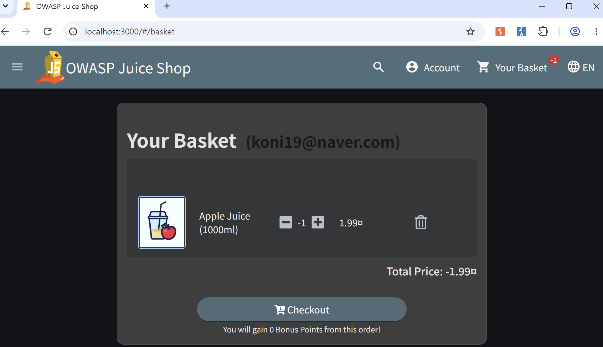
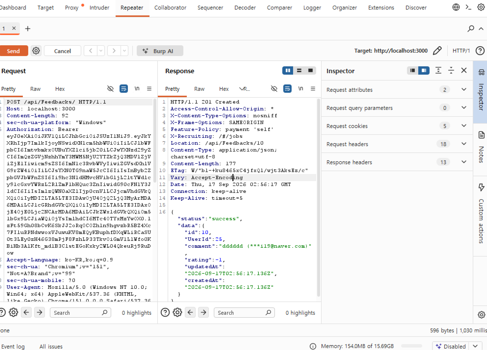
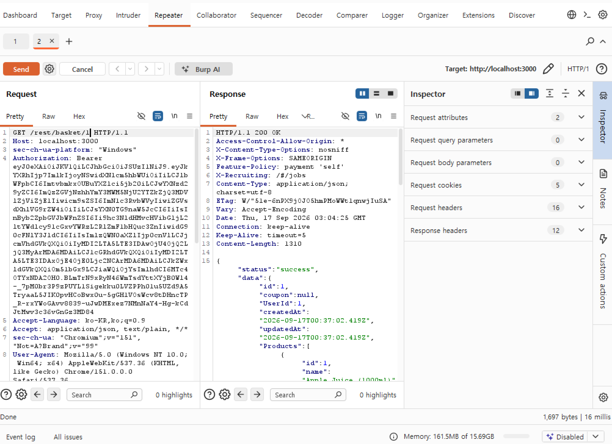

# Burp Suite를 활용한 HTTP 요청 조작 실습

Date: 2026-09-17
Category: Web Security / Hands-on

## 1. 학습 목표

Burp Suite를 이용해 웹 애플리케이션의 HTTP 요청을 관찰하고, 요청 내용을 직접 변경한 뒤 서버의 처리 결과 확인

## 2. 학습 내용
### 2.1 Intercepting Proxy

Burp Suite를 학습하면서 Proxy의 기본적인 역할을 이해

Proxy는 클라이언트와 서버 사이에서 요청과 응답을 중계하는 역할을 하며, Burp Suite는 이를 이용해 브라우저와 웹 서버 사이에서 발생하는 HTTP 요청을 관찰하고 필요한 경우 요청 수정 가능.

Browser
   ↓
Burp Suite Proxy
   ↓
Web Server / Application
   ↓
Response
   ↓
Browser

특히 요청을 바로 서버로 전달하지 않고 Burp Suite에서 Intercept한 뒤 내용을 확인하고 수정한 다음 Forward할 수 있다는 점을 실습을 통해 확인

이를 통해 브라우저에서 수행한 하나의 행동이 실제 HTTP Request로 전달되며, 그 요청을 중간에서 관찰하고 조작할 수 있다는 점 이해

### 2.2 HTTP Request 분석

Burp Suite에서 실제 요청을 확인하면서 다음 요소를 관찰

- HTTP Method

- URL

- Request Header

- Request Body

서버에 전달되는 입력값

단순히 화면에서 값을 변경하는 것이 아니라, 실제 서버에 전달되는 Request를 확인해야 어떤 값이 처리 과정에 사용되는지 파악할 수 있다는 점 확인

## 3. 실습한 내용

### 3.1 주문 수량 조작

Juice Shop에서 상품 주문 과정의 HTTP 요청 확인

주문 과정에서 발생하는 요청을 Intercept 
HTTP Method가 PUT임을 확인
Request에서 상품 수량을 담당하는 값을 식별
해당 값을 변경 (해당 부분에서 수량에 -1을 입력함)
수정된 Request를 Forward
변경한 수량이 실제 처리 결과에 반영되는 것을 확인

이를 통해 클라이언트에서 전달하는 값이 실제 서버 처리에 사용되는 과정을 직접 확인

### 3.2 리뷰 별점 변조

리뷰 작성 과정에서 발생하는 HTTP Request를 확인하고 별점과 관련된 값을 변경 
 - 별점 등록 시 5점으로 등록한 뒤, burf suite repeater에서 -1로 평가 점수 변경

이를 통해 사용자 인터페이스에서 입력한 값과 실제 서버로 전달되는 값 사이의 관계를 확인하고, 클라이언트에서 전달되는 값을 직접 변경할 수 있다는 점을 경험

### 3.3 다른 사용자의 장바구니 접근

장바구니 관련 Request를 분석하여 다른 사용자의 장바구니 데이터에 접근하는 과정을 확인
 - 장바구니에서 3번 '바나나주스'를 선택한 상태에서 유저 번호를 1번으로 변경
 - 1번 유저의 장바구니에서 1번 '사과주스'를 선택한 화면이 출력

이 실습을 통해 단순한 값 변조뿐 아니라 사용자 식별 정보와 접근 권한에 대한 검증이 웹 애플리케이션 보안에서 중요하다는 점을 확인

## 4. Troubleshooting

### 4.1 수량을 1000으로 변경했을 때 400 Bad Request가 발생한 이유 추적

- 상황: 수량 조작을 위해 HTTP Request Body의 수량 값을 1000 같은 값으로 수정하고 전송했으나, 우측 Response 창에 404 Not Found가 떨어짐.

- 원인: Request와 Response를 다시 확인하면서 클라이언트에서 전달하는 값과 서버에서 허용하는 값 사이에 검증 과정이 존재할 수 있다는 점을 확인

- 해결: 서버에서 허용하는 값의 범위에 있을 법한 다른 값을 입력하여 정상적으로 수량 조작 로직을 통과시킴.

### 4.2 Repeater로 Request를 가져오는 과정에서 패킷을 가져오지 못했던 이유

- 상황: 브라우저 액션이 Burp Suite에 곧바로 잡히지 않거나, 패킷을 실험실로 옮기는 과정에서의 조율.

- 원인: 요청을 단순히 전달하는 것과 반복해서 수정·전송하기 위한 Request를 Repeater에 확보하는 과정이 별도로 존재한다는 점을 인지하지 못했음.

- 해결: Request를 Repeater에 확보하는 과정이 별도로 존재함을 인지한 뒤, Intercept is on/off 타이밍을 맞추고 Ctrl + R로 Repeater로 안전하게 이관하는 워크플로우를 체득함.

이를 통해 Repeater는 단순히 패킷을 한 번 전달하는 기능이 아니라, 하나의 HTTP Request를 반복적으로 수정하고 비교하기 위한 도구라는 점을 이해

## 5. 오늘 확인한 보안 관점

세 가지 실습을 통해 공통적인 흐름을 확인

정상적인 사용자 행동
        ↓
HTTP Request 발생
        ↓
Burp Suite에서 Request 관찰
        ↓
특정 값 또는 식별자 변경
        ↓
Forward / 재전송
        ↓
Server 처리 결과 확인

오늘 실습에서 중요한 점은 단순히 Request의 값을 바꾸는 것이 아니라,

어떤 값이 서버에 전달되는지 → 서버가 그 값을 어떻게 처리하는지 → 변경된 값에 어떤 검증이 이루어지는지를 확인하는 과정

특히 요청을 조작할 수 있다는 사실만으로 취약점이 결정되는 것이 아니라, 서버의 검증 및 접근 제어 방식에 따라 결과가 달라질 수 있다는 점을 확인

## 6. 추가 시도 — 쿠폰 번호 조작

쿠폰 번호 조작도 시도했으나, 앞선 실습처럼 기존 Request의 값을 단순히 변경하는 방식으로 끝나지 않는 형태임을 확인함

별도의 쿠폰 생성 과정과 생성 규칙을 추가로 분석해야 했기 때문에 현재 세션에서 무리하게 진행하지 않고 후속 학습으로 보류

이번 시도를 통해 모든 보안 실습이 동일한 난이도나 동일한 요청 조작 방식으로 해결되는 것은 아니라는 점도 확인

## 7. 배운 점

오늘 실습을 통해 다음 내용을 실제 환경에서 확인

| 단계 | 확인내용 |
| :--- | :---: |
| 1 | Burp Suite 세팅 및 Burp Suite Proxy의 기본적인 역할 | 
| :--- | :---: |
| 2 | Browser와 Server 사이의 HTTP Request 흐름 | 
| :--- | :---: |
| 3 | Browser와 Server 사이의 HTTP Request 흐름 | 
| :--- | :---: |
| 4 | HTTP Method 확인 | 
| :--- | :---: |
| 5 | Request Header / Body 확인 | 
| :--- | :---: |
| 6 | Request 값 변경 | 
| :--- | :---: |
| 7 | Intercept 후 Forward | 
| :--- | :---: |
| 8 | Repeater를 통한 Request 재전송 및 비교 | 
| :--- | :---: |
| 9 | 서버의 검증에 따른 정상 처리와 오류 응답 | 
| :--- | :---: |
| 10 | 사용자 입력값 및 식별자 조작이 보안 문제로 이어질 수 있는 가능성 | 

## 8. Next

Burp Suite를 이용해 HTTP Request를 분석하고 재전송하는 작업을 조금 더 익힌 뒤, 오늘 확인한 입력값 검증, 접근 제어, 비즈니스 로직​이 실제 웹 취약점과 어떻게 연결되는지 학습 예정