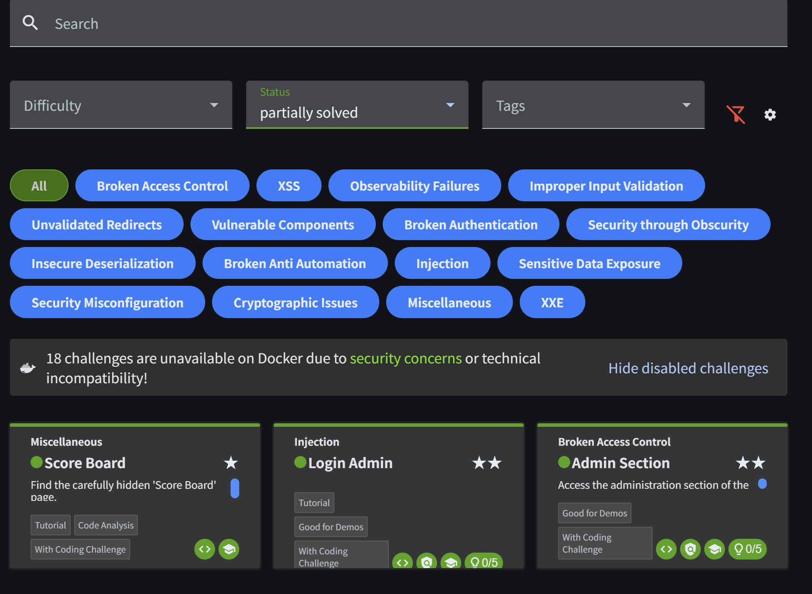

# Web 취약성 실습

**Date:** 2026-09-18
**Category:** Web Security / Hands-on

## 1. 학습 목표

Juice Shop을 대상으로 대표적인 웹 취약점을 직접 재현하고, 각 취약점이 어떤 처리 과정에서 발생하는지 이해.

또한 이전에 학습한 HTTP Request 조작과 연결하여, **클라이언트에서 전달되는 값과 서버의 검증·권한 처리 방식이 웹 보안에 어떤 영향을 주는지** 확인.

---

## 2. 학습 내용

### 2.1 SQL Injection

사용자 입력이 서버에서 SQL Query의 일부로 해석될 수 있는 경우 발생할 수 있는 SQL Injection을 실습.

#### 관리자 계정 접근 (관리자 권한 인증 우회 방식)

로그인 과정에서 SQL Injection을 활용하여 정상적인 인증 조건에 영향을 주고 관리자 계정으로 접근하는 과정 확인.

이 과정에서 사용자 입력이 단순한 문자열이 아니라 서버에서 실행되는 SQL Query의 일부로 처리될 수 있다는 점을 확인.

#### 1=1을 이용한 기본적인 SQL Injection 방식 (무조건 참 논리 우회 방식)

1=1은 SQL에서 항상 참이 되는 조건임. 이를 OR 등의 논리 조건과 결합하여 기존 WHERE 절의 논리를 변경하는 방식이 SQL Injection의 대표적인 예시 중 하나임을 학습.

예를 들어 인증 Query가 다음과 같은 형태라고 가정하면:

WHERE username = '입력값'
  AND password = '입력값'

공격자가 입력값을 통해 항상 참인 조건을 추가하고, 필요한 경우 뒤쪽 Query를 주석 처리하면 비밀번호 조건 등이 의도대로 적용되지 않을 수 있음.

다만, Juice Shop에서는 일반적인 1=1 방식이 바로 동작하지 않았으며, 실제 Query 구조와 입력값 처리 방식에 따라 결과가 달라질 수 있음을 확인함. 
 - juice-shop 로그인 화면에서 id에 ' OR 1=1 -- 입력 후 이전과 동일하게 비밀번호는 아무 문자열을 입력 후 로그인 버튼 클릭

이를 통해 SQL Injection은 특정 공격 문자열을 암기하는 것이 아니라, 사용자 입력이 최종 SQL Query에 어떻게 반영되고 논리가 어떻게 변경되는지를 이해하는 것이 중요하다​는 점을 배움.

---

### 2.2 Cross-Site Scripting (XSS)

XSS는 공격자가 삽입한 Script가 웹 애플리케이션을 통해 사용자의 브라우저에서 실행될 수 있는 취약점이다.

대표적으로 **Reflected XSS(반사형)**와 **Stored XSS(저장형)**로 구분할 수 있다.

| 유형                | 동작 방식                                                 | 특징                           |
| ----------------- | ----------------------------------------------------- | ---------------------------- |
| **Reflected XSS** | 사용자가 전달한 악성 입력이 서버에 저장되지 않고 응답에 포함되어 실행               | 요청과 응답 과정에서 악성 입력이 즉시 반영됨    |
| **Stored XSS**    | 악성 입력이 서버 또는 DB 등에 저장된 후 다른 사용자가 해당 데이터를 조회하는 과정에서 실행 | 저장된 입력이 이후 다른 사용자에게 전달될 수 있음 |

#### XSS 실습에서 확인한 내용

Reflected XSS와 Stored XSS를 각각 실습하면서 두 방식의 차이를 비교함.

* **Reflected XSS:** 악성 입력이 요청에 포함되고 서버의 응답에 반영되는 방식
* **Stored XSS:** 악성 입력이 저장된 후 이후 페이지 출력 과정에서 다시 사용되는 방식

두 유형 모두 사용자 입력이 적절하게 처리되지 않을 경우 브라우저에서 Script가 실행될 수 있다는 공통점이 있지만, **악성 입력의 저장 여부와 피해가 전달되는 방식이 다르다는 점**을 확인함.

---
### 2.3 숨겨진 페이지 찾기

어플리케이션 및 웹에서 드러나지 않는 페이지 탐색 

이를 통해 노출되지 않는 페이지나, 기능이 있을 수 있으며 페이지 노출 여부와 접근 권한 검증은 별개의 영역이라는 점을 확인함.

---

## 3. 실습

| 실습                            | 수행 내용                                             | 확인 결과                                  |
| ----------------------------- | ------------------------------------------------- | -------------------------------------- |
| **SQL Injection - 관리자 계정 접근** | 로그인 과정에서 SQL Injection을 적용하여 인증 흐름에 영향을 줌         | 관리자 계정 접근 재현                           |
| **SQL Injection - `1=1` 방식**  | 일반적인 `1=1` 형태의 SQL Injection을 시도하고 Query 처리 방식 확인 | 기본적인 방식이 바로 동작하지 않는 사례 확인 및 다른 방식으로 재현 |
| **Reflected XSS**             | juice-shop 검색 필드에 특정 alert을 출력하는 Script를 검색 값으로 입력 후 검색              | 검색 시 입력한 스크립트의 alert이 출력됨을 확인            |
| **Stored XSS**                | juice-shop 리뷰 작성 시 comment에 특정 팝업이 나오는 스크립트를 작성 후 저장한 뒤, 관리자 계정으로 로그인하여 관리자 페이지 진입                  | 의도했던 팝업이 출력되지는 않았으나, challenge solved 문구는 확인됨      |
| **숨겨진 페이지 탐색**                | juice-shop 내에서 접근할 수 없는 scoreboard 페이지 url 검색 후 진입하여 숨겨진 페이지 진입 성공                     | 기능의 노출 여부와 접근 권한 검증이 별개의 문제임을 확인       |



---

## 4. 평가

실습 후 학습 내용을 다시 확인하면서 다음 내용을 평가.

### 4.1 서버 측 검증

이전 HTTP Request 조작 실습과 연결하여, 클라이언트에서 Request Body 또는 입력값을 직접 변경할 수 있더라도 **서버가 전달받은 값을 별도로 검증해야 한다는 점**을 다시 확인.

```text
Client
   ↓
HTTP Request
   ↓
값 조작 가능
   ↓
Server
   ↓
입력값 / 권한 / 비즈니스 로직 검증
   ↓
처리 또는 거부
```

이를 통해 **“클라이언트의 값을 변경할 수 있다”와 “취약점이 존재한다”는 동일한 의미가 아니라는 점**을 이해.

### 4.2 SQL Injection과 주석 처리

SQL Injection 과정에서 입력값에 포함된 SQL 구문과 주석 처리가 이후 Query에 어떤 영향을 주는지 복습 진행.

주석 처리가 잘못 활용될 경우 Query의 뒤쪽 부분이 정상적으로 조건에 참여하지 못하면서 **비밀번호 검증 조건 등이 의도대로 적용되지 않을 수 있다는 원리**를 이해.

---

## 5. 오늘 배운 점

오늘 실습한 취약점은 서로 공격 방식과 발생 지점이 달랐지만, 공통적으로 **웹 애플리케이션이 사용자 입력과 요청을 어떻게 처리하고 검증하는지**가 중요하다는 점을 확인함.

| 유형                | 주요 관점            | 핵심 내용                                |
| ----------------- | ---------------- | ------------------------------------ |
| **SQL Injection** | 입력값 → SQL 처리     | 사용자 입력이 Query의 동작에 영향을 줄 수 있음        |
| **Reflected XSS**    | 입력 → 서버처리 → 출력 → 브라우저 실행     | 입력값이 입력 후 즉시 브라우저에서 스크립트를 해석하여 실행됨 |
| **Stored XSS**    | 입력 → 저장 → 출력     | 저장된 입력값이 이후 출력 과정에서 Script로 처리될 수 있음 |
| **숨겨진 페이지 찾기**         | 페이지 노출 / 접근 경로 | 화면에 노출되지 않은 페이지도 실제 애플리케이션에 존재할 수 있으며, 페이지를 숨기는 것과 접근을 통제하는 것은 별개의 문제임을 확인   |

또한 동일한 웹 애플리케이션에서 HTTP Request를 관찰하고 조작하더라도, **어떤 데이터 처리 과정과 보안 검증이 영향을 받는지에 따라 서로 다른 형태의 취약점이 발생할 수 있음**을 확인.

---

## 6. Key Takeaway

오늘은 Juice Shop을 대상으로 SQL Injection, Stored XSS, 접근 제어 관련 실습을 직접 수행하면서 **웹 취약점은 공격 문자열이나 도구 사용법만 외우는 것이 아니라 애플리케이션의 처리 흐름을 이해해야 재현하고 설명할 수 있다는 점**을 확인함.

특히 SQL Injection에서는 입력값이 Query에 어떻게 반영되는지가 중요했고, Stored XSS에서는 입력값의 저장과 출력 과정을 확인해야 했으며, 숨겨진 페이지 탐색에서는 기능의 존재 여부와 접근 권한 검증을 구분해서 볼 필요가 있음을 이해함.

또한 이전의 Burp Suite 실습과 연결하여 **클라이언트에서 데이터를 조작할 수 있는 환경에서도 최종적인 입력값과 권한 검증은 서버에서 수행되어야 한다는 점**을 다시 확인.

---

## 7. Next

오늘 학습한 SQL Injection, Reflected XSS, Stored XSS 및 접근 제어 관련 개념의 차이와 발생 원리를 정리하고, 각 취약점이 실제 애플리케이션의 어느 처리 과정에서 발생하는지 연결해서 학습.
