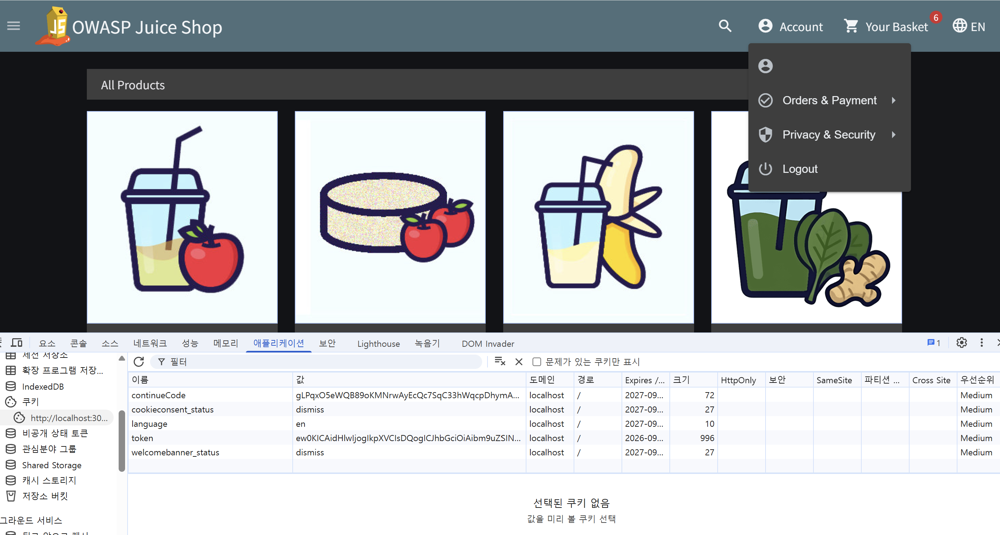
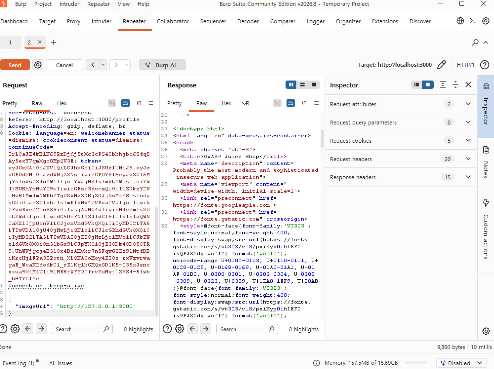
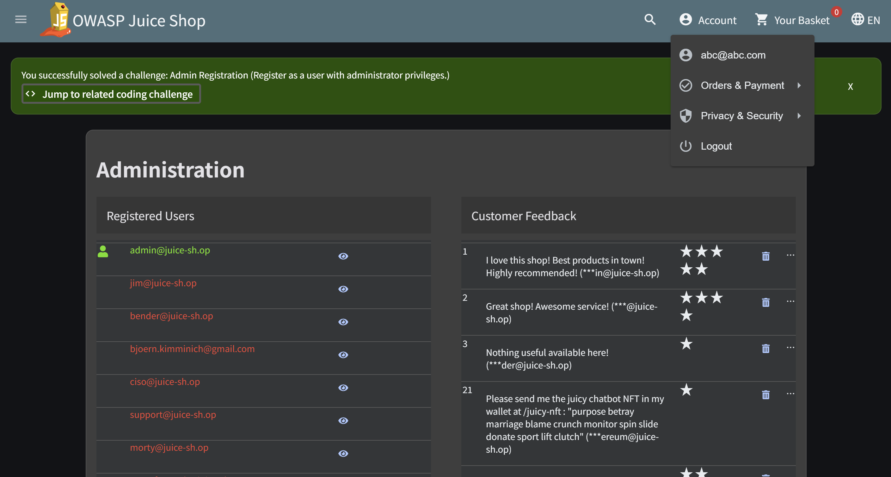

# JWT / SSRF / Access Control 실습

**Date:** 2026-09-20
**Category:** Web Security / Hands-on

## 1. 학습 목표

Juice Shop을 대상으로 JWT, SSRF, 접근 제어 관련 취약점을 직접 실습하고, 각각의 취약점이 인증·인가와 서버 측 요청 처리 과정에서 어떻게 발생할 수 있는지 이해

또한 HTTP Request의 구성 요소와 Method가 실제 보안 실습 결과에 어떤 영향을 주는지 확인한다.

---

## 2. 학습 내용

### 2.1 JWT (JSON Web Token)

JWT는 웹 애플리케이션에서 인증 정보를 전달하는 데 사용할 수 있는 토큰 형식으로, 일반적으로 다음 세 부분으로 구성

```text id="5l6urq"
Header.Payload.Signature
```

| 구성 요소         | 역할                                    | 예시                          |
| ------------- | ------------------------------------- | --------------------------- |
| **Header**    | 토큰 유형과 서명 알고리즘 정보                     | `typ: JWT`, `alg: HS256`    |
| **Payload**   | 사용자 식별, 권한, 발급·만료 시간 등의 Claim         | `sub`, `role`, `iat`, `exp` |
| **Signature** | Header와 Payload가 변조되지 않았는지 검증하기 위한 서명 | 서명 알고리즘과 키를 이용해 생성          |

Payload는 일반적으로 암호화된 값이 아니라 Base64URL로 인코딩된 값이므로 내용을 읽는 것 자체는 가능. 따라서 JWT에서는 **Payload를 변경할 수 있는지보다 서버가 Signature와 Claim을 적절하게 검증하는지가 중요**

이번 실습에서는 JWT를 변조하여 인증 정보에 영향을 줄 수 있는 과정을 확인

### 2.2 SSRF (Server-Side Request Forgery)

SSRF는 사용자가 지정한 요청 대상 또는 URL 등을 서버가 대신 요청하도록 유도하는 형태의 취약점

```text id="8x67vr"
Client
  ↓
Web Application
  ↓
Server가 지정된 대상에 요청
  ↓
Target
```

### 2.3 Broken Access Control

사용자에게 허용된 범위를 벗어난 기능이나 데이터에 접근할 수 있는 경우 발생할 수 있는 접근 제어 문제를 실습

이를 통해 인증된 사용자라는 사실과 **특정 데이터 또는 기능에 접근할 권한이 있는지는 별도의 검증이 필요하다**는 점을 확인

---

## 3. Hands-on

| 실습                        | 수행 내용                           | 확인 결과                                                         |
| ------------------------- | ------------------------------- | ------------------------------------------------------------- |
| **JWT 위조**                | JWT를 확인하고 인증 관련 정보를 변조하여 요청     | 토큰 교체는 수행했으나 `account` 정보가 빈 객체 형태로 표시되었고, 관리자 권한 획득은 확인하지 못함 |
| **SSRF**                  | 서버가 외부 요청을 수행하는 기능을 분석하고 요청을 변조 | 서버 측에서 요청을 수행하는 SSRF 구조 확인                                    |
| **Broken Access Control** | 권한이 없는 범위의 기능/데이터에 접근하는 과정 확인   | 적절한 접근 권한 검증이 중요함을 확인                                         |

---

## 4. Troubleshooting

### 4.1 SSRF 요청 Method 오류

증상: SSRF 취약점 검증을 위해 /profile/image/url에 POST 요청을 보냈으나, 페이로드를 다양하게 바꿔도 계속 302 응답만 반환됨. 에러 메시지가 없어 판단이 어려웠음.

원인 분석: 302는 이 엔드포인트가 처리 성공/실패와 무관하게 항상 반환하는 리다이렉트 응답이라는 것을 확인. 이후 Score Board를 통한 검증, 소스코드 확인 등으로 원인을 좁혀나간 결과, HTTP 메서드가 POST가 아니라 PUT이어야 했다는 것을 발견. Express 라우팅에서 등록되지 않은 메서드로 요청 시 명시적 에러 없이 조용히 리다이렉트로 빠지는 것이 원인이었음.

교훈: 동일한 URL이라도 HTTP 메서드가 다르면 완전히 다른 핸들러로 처리되며, 이런 경우 명확한 에러 코드(404/405) 없이 모호한 응답이 나올 수 있어 디버깅 난이도가 높아짐.

```text id="czhlcs"
잘못된 요청
POST
  ↓
예상한 결과가 나오지 않음

Method 재확인
  ↓
PUT이 필요함을 확인

PUT
  ↓
다시 요청
  ↓
정상적인 실습 흐름 확인
```

이를 통해 보안 실습에서 URL이나 Parameter뿐만 아니라 **HTTP Method 역시 서버의 처리 방식과 실습 결과에 직접적인 영향을 주는 중요한 Request 구성 요소**라는 점을 경험함.

### 4.2 JWT 실습 결과 확인

증상: alg: none JWT 위조 시도 후, 계정 정보 화면에 값이 빈 칸으로 표시됨. /rest/user/whoami API로 확인해도 응답이 {"user":{}}로 비어있어, 위조가 실패한 것인지 판단이 어려웠음

원인 분석: 
 - 위조한 JWT를 디코딩해서 header/payload 구조를 직접 검증 → 인코딩·구조 자체는 문제없음을 확인
 - whoami가 정상/위조 토큰 모두에 동일한 반응을 보이는 것을 발견 → 이 엔드포인트로는 성공 여부를 구분할 수 없다는 결론
 - 검증 방법을 API 응답 대신 브라우저에서 /#/administration 직접 접근으로 전환 → 403 확인
 - 이를 통해 "API 응답이 비어있다"는 현상 자체가 위조 실패의 증거가 아니라,애초에 검증 도구 선택이 잘못됐던 것임을 규명

이 Juice Shop 버전(v20.2.0)에서는 alg:none 취약점이 서버 레벨에서 막혀 있는 것으로 보이며(GitHub 이슈 확인), 위조 기법 자체의 구현은 정확했음.

하나의 API 응답만으로 성공/실패를 판단하지 말고, 같은 조건에서 통제군(정상 토큰)과 실험군(위조 토큰)의 결과를 비교해야 진짜 원인을 좁힐 수 있다는 것을 체감함.

---

## 5. Assessment

### 5.1 JWT

기존에 생성했던 계정에서 다른 계정 정보를 입력하여 계정 정보 및 권한 탈취 시도
 - 로그인 과정에서 burfsuite에서 인터셉트하여 request body 내 유저 정보 중 id를 바꾸고 role: admin으로 바꿔 관리자 권한 탈취 시도 

JWT의 alg: none 취약점을 이용해 서명 검증을 우회하고, role: admin으로 권한 상승 시도

JWT의 `Header`, `Payload`, `Signature`의 역할을 구분하고, Payload를 변경할 수 있다는 사실과 서버가 해당 토큰을 유효한 인증 정보로 인정하는 것은 별개의 문제임을 확인함.



### 5.2 SSRF

프로필 페이지 진입 후 burfsuite에서 인터셉트하여 이미지 url을 이용하여 메소드를 put으로 바꾸고 JSON 본문({"imageUrl": "[http://127.0.0.1:3000](http://127.0.0.1:3000)"})을 구성하여 서버가 내부망 리소스를 직접 조회하도록 유도.

SSRF가 클라이언트가 직접 다른 서버에 요청하는 것이 아니라, **웹 애플리케이션 서버가 공격자가 의도한 대상에 대신 요청하도록 만드는 문제**라는 점을 확인함.

또한 실제 실습에서 HTTP Method를 잘못 지정했을 때 요청이 정상적으로 처리되지 않는 상황을 통해 Request 구성 요소를 다시 확인함.



### 5.3 Access Control

회원가입 과정에서 burfsuite에서 인터셉트하여 신규 일반 회원 계정에 관리자 권한을 부여
 - request body에 role: admin 추가
 - 가로챈 request를 변경하여 forward한 뒤, 해당 계정으로 로그인
 - 해당 계정으로 /administration 페이지 진입

인증 여부와 별개로 사용자가 수행할 수 있는 기능과 접근 가능한 데이터의 범위를 서버에서 검증해야 한다는 점을 확인함.



---

## 6. 오늘 배운 점

오늘 실습한 세 가지는 서로 다른 보안 영역을 다루었지만, 공통적으로 **서버가 클라이언트의 요청과 인증 정보를 어떤 방식으로 해석하고 검증하는가**가 중요하다는 점을 확인함.

| 유형                        | 주요 관점                    | 핵심 내용                                                 |
| ------------------------- | ------------------------ | ----------------------------------------------------- |
| **JWT**                   | 인증 정보 / Token Validation | 토큰 변조와 실제 인증·권한 부여는 별개의 과정이며 서버의 검증이 중요              |
| **SSRF**                  | Server-side Request      | 서버가 사용자 입력을 바탕으로 다른 대상에 요청을 수행할 수 있음                  |
| **Broken Access Control** | 권한 검증                    | 인증된 사용자라도 허용된 범위를 벗어난 기능이나 데이터에 접근하지 못하도록 서버에서 검증해야 함 |

또한 오늘 SSRF 실습을 통해 **HTTP Method, URL, Parameter 등 Request의 각 요소가 실제 서버 처리에 영향을 줄 수 있으므로 요청 전체를 확인하는 습관이 중요하다**는 점을 경험함.

---

## 7. Key Takeaway

오늘은 JWT 위조, SSRF, Broken Access Control 관련 실습을 수행하면서 **웹 보안은 특정 공격 방법을 실행하는 것보다 서버가 요청을 받아 인증·인가하고 처리하는 전체 흐름을 이해하는 것이 중요하다**는 점을 확인함.

특히 JWT에서는 토큰의 구조와 검증 과정을, SSRF에서는 서버 측 요청의 흐름을, 접근 제어에서는 인증과 실제 권한의 차이를 확인함.

또한 실습 중 HTTP Method를 잘못 지정하여 정상적으로 동작하지 않았던 경험을 통해 **Request의 작은 구성 차이도 서버 처리 결과를 바꿀 수 있다는 점**을 직접 확인함.

---

## 8. Next

오늘 학습한 JWT, SSRF, Broken Access Control의 차이를 다시 정리하고, 각 취약점이 실제 애플리케이션의 인증·인가·요청 처리 과정에서 어느 지점에서 발생하는지 연결해서 학습 예정.
