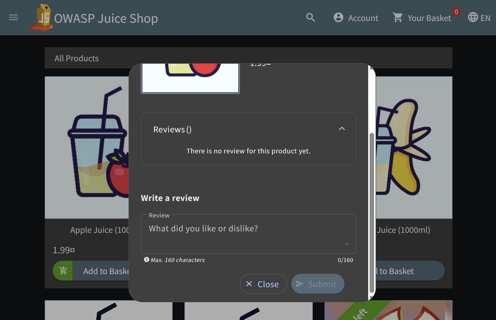
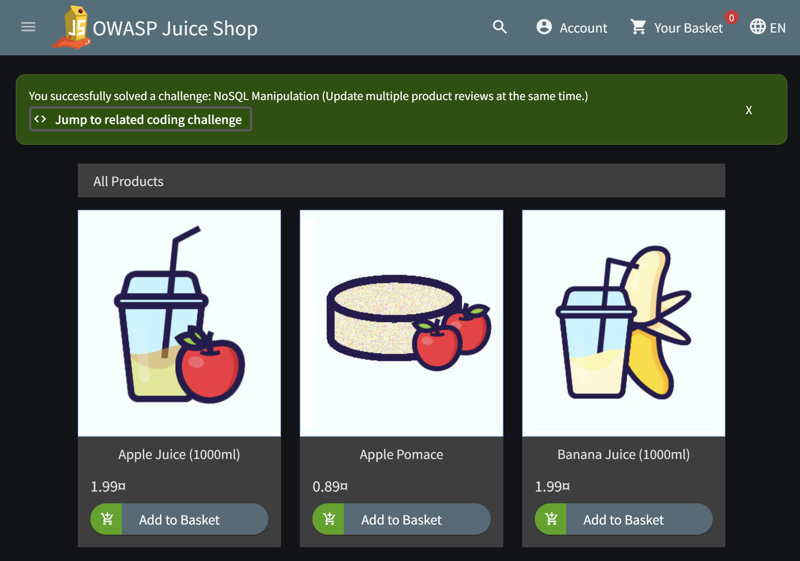
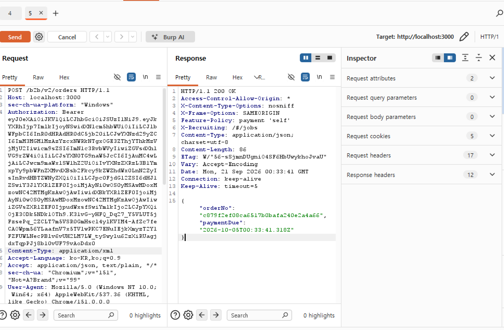
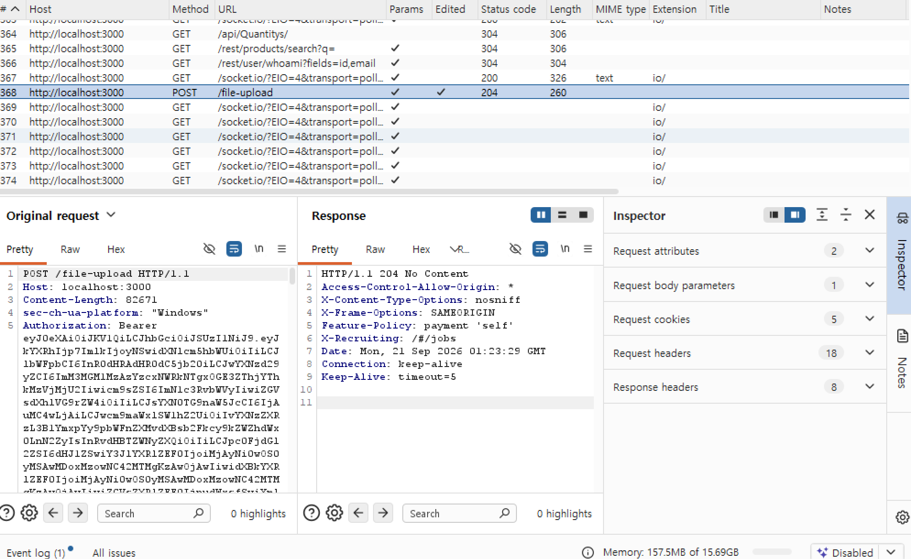

# 웹 취약성 실습 (Nosql, XXE, File Upload Validation)

**Date:** 2026-09-21
**Category:** Web Security / Hands-on

## 1. 학습 목표

Juice Shop을 대상으로 NoSQL Manipulation, XXE, 악성 파일 업로드 관련 취약점을 실습하고, 각각의 취약점이 사용자 입력 및 서버 처리 과정에서 어떻게 발생할 수 있는지 이해

또한 지금까지 학습한 SQL Injection, XSS, SSRF, JWT, 접근 제어 등의 취약점과 비교하여 **입력값 검증과 서버 측 처리의 중요성**을 다시 확인

---

## 2. 학습 내용

### 2.1 NoSQL Manipulation

NoSQL 데이터베이스를 사용하는 애플리케이션에서 사용자 입력이 Query 또는 연산 처리에 영향을 줄 경우 발생할 수 있는 NoSQL Injection을 실습

SQL Injection과 유사하게 사용자 입력이 단순한 값으로 처리되지 않고 **데이터베이스 Query의 일부 또는 연산 처리에 영향을 줄 수 있다는 점**을 확인함.

이를 통해 데이터베이스가 SQL인지 NoSQL인지에 따라 구체적인 공격 방식은 달라질 수 있지만, **신뢰할 수 없는 사용자 입력이 서버의 데이터 처리 로직에 직접 영향을 주지 않도록 검증하는 것이 중요하다**는 점을 이해함.




### 2.2 XXE (XML External Entity)

XML Parser가 외부 Entity를 처리하는 과정에서 발생할 수 있는 XXE 취약점을 실습했다.

Burp Suite에서 기존 요청을 확인한 후 HTTP Method를 `POST`로 변경하고 Content-Type을 XML 형식으로 수정하여 XML 데이터를 전달함.

XML의 External Entity를 다음과 같이 정의하고:

```xml
<?xml version="1.0" encoding="UTF-8"?>
<!DOCTYPE foo [ 
  <!ENTITY xxe SYSTEM "file:///etc/passwd"> 
]>
<b2bOrder>
  <companyName>&xxe;</companyName>
</b2bOrder>
```

`&xxe;`를 통해 정의한 Entity를 참조하여 서버가 `file:///etc/passwd`에 접근하도록 유도함.

이를 통해 **XML Parser가 외부 Entity를 처리하도록 구성되어 있을 경우, 공격자가 서버 측 자원에 접근하도록 유도할 수 있다는 XXE의 기본 원리**를 확인함.



### 2.3 Upload Type Validation

파일 업로드 기능에서 허용된 파일 형식에 대한 검증 방식을 확인함.

PDF 파일을 업로드한 뒤 파일 확장자를 `.exe` 또는 `.zip` 등으로 변경하여 허용되지 않은 형식의 파일도 업로드할 수 있는지 확인함.

이를 통해 파일 업로드 기능에서는 사용자가 입력한 **파일명이나 확장자만 신뢰하지 않고, 서버 측에서 실제 파일 형식과 업로드 가능 여부를 검증하는 것이 중요하다**는 점을 이해함.



---

## 3. Hands-on

| 실습                        | 수행 내용                                                                              | 확인 결과                                               |
| ------------------------- | ---------------------------------------------------------------------------------- | --------------------------------------------------- |
| **NoSQL Manipulation**    | 사용자 입력을 활용하여 NoSQL Query 처리에 영향을 주는 과정 확인                                          | NoSQL 환경에서도 입력값 검증이 중요함을 확인                         |
| **XXE**                   | Burp Suite에서 요청을 `POST`로 변경하고 Content-Type을 XML로 수정한 후 External Entity를 포함한 XML 전달 | XML Parser의 External Entity 처리 과정과 서버 측 자원 접근 원리 확인 |
| **Malicious File Upload** | PDF 파일을 업로드한 뒤, 파일 확장자를 zip으로 변경하여 허용되지 않은 형식의 업로드 시도                                        | 파일 형식 및 업로드 처리 과정에 대한 서버 측 검증의 중요성을 확인              |

---

## 4. Troubleshooting

### 4.1 XXE 요청 과정에서 `401 Unauthorized` 발생

XXE 실습 과정에서 기존 요청을 `POST`로 변경하고 XML Payload를 전달했으나 `HTTP/1.1 401 Unauthorized` 응답이 반환되었음.

처음에는 Content-Type을 확인하지 못한 상태에서 기존 요청을 기준으로 임의로 `POST` 요청을 구성하여 시도함.

이후 다른 패킷을 다시 확인하던 중 Content-Type이 지정되지 않은 요청을 확인했고, 해당 요청에 XML 형식에 맞는 Content-Type을 추가한 뒤 XML Payload를 전달하여 실습을 진행함.

이를 통해 **HTTP Method뿐만 아니라 Content-Type과 Request Body의 형식도 서버가 요청을 처리하는 데 중요한 요소이며, 예상한 응답이 나오지 않을 경우 기존 정상 요청의 형태를 다시 확인하는 것이 중요하다**는 점을 경험함.

### 4.2 파일 업로드 대상 파일 문제

악성 파일 업로드 실습에서 처음에는 Juice Shop에서 확인할 수 있는 기존 파일을 이용하여 업로드를 시도했으나 정상적으로 업로드되지 않았음.

확인 결과 Juice Shop 내 업로드가 가능한 파일 확장자를 업로드 해야만 POST 리퀘스트가 잡힌다는 점을 확인함.

이후 별도로 준비한 PDF 파일을 사용하여 다시 업로드를 시도했고 정상적으로 실습을 진행할 수 있었음.

이를 통해 **업로드 기능 자체의 문제인지 테스트에 사용하는 파일의 형식이나 상태에 따른 문제인지 구분하여 확인할 필요가 있다**는 점을 경험함.

---

## 5. Assessment

### 5.1 NoSQL Manipulation

NoSQL 환경에서도 사용자 입력이 데이터베이스 Query 또는 연산 처리에 영향을 줄 수 있으며, SQL Injection과 구체적인 방식은 다르더라도 **입력값을 안전하게 처리해야 한다는 기본 원리는 동일함**을 확인함.

### 5.2 XXE

XML 문서에서 External Entity를 정의하고 참조하는 기본 구조를 확인했다.

또한 Burp Suite를 이용해 HTTP Method와 Content-Type을 변경하고 XML Payload를 전달하면서, **XML Parser의 설정에 따라 외부 Entity가 서버 측 자원 접근으로 이어질 수 있다는 점**을 확인함.

### 5.3 File Upload Validation

파일 업로드 기능에서는 클라이언트에서 보이는 확장자만 확인하는 것으로 충분하지 않으며, **서버 측에서 파일 형식과 업로드 처리 과정을 검증해야 한다**는 점을 확인했다.

---

## 6. 오늘 배운 점

오늘 학습한 세 가지 취약점은 서로 발생 방식은 다르지만, 공통적으로 **사용자 입력을 서버가 어떻게 해석하고 처리하는가**가 중요하다는 점을 확인함.

| 유형                     | 주요 관점                | 핵심 내용                                       |
| ---------------------- | -------------------- | ------------------------------------------- |
| **NoSQL Manipulation** | 입력값 → NoSQL Query 처리 | 사용자 입력이 Query 또는 연산 처리에 영향을 줄 수 있음          |
| **XXE**                | XML 입력 → Parser 처리   | XML Parser 설정에 따라 External Entity가 처리될 수 있음 |
| **File Upload**        | 파일 입력 → 서버 처리        | 파일 형식·확장자 및 업로드 처리 과정 등에 대한 검증이 필요함               |

또한 지금까지 SQL Injection, XSS, SSRF, JWT, 접근 제어 등 다양한 웹 취약점을 실습하면서, **웹 보안 테스트에서는 특정 공격 문자열을 암기하는 것보다 애플리케이션의 입력 처리와 서버 측 검증 과정을 이해하는 것이 중요하다**는 점을 다시 확인했음.

---

## 7. Key Takeaway

오늘은 NoSQL Manipulation, XXE, 악성 파일 업로드를 실습하면서 웹 애플리케이션의 다양한 입력 지점에서 보안 문제가 발생할 수 있음을 확인함.

NoSQL Manipulation에서는 데이터베이스 Query 처리 과정, XXE에서는 XML Parser의 External Entity 처리, 파일 업로드에서는 파일 형식과 업로드 처리 과정이 각각 중요한 보안 지점이라는 것을 확인함.

특히 XXE 실습 중 `401 Unauthorized` 응답을 확인한 뒤 다른 패킷의 구조를 다시 비교하여 요청을 수정한 과정을 통해 **문제가 발생했을 때 단순히 Payload만 수정하는 것이 아니라 정상 요청의 구조와 차이를 비교하면서 원인을 좁혀가는 것이 중요하다는 점**을 경험했다.

또한 파일 업로드 실습에서는 테스트 대상 파일 자체를 변경하여 정상적인 업로드 여부를 다시 확인하면서 **기능의 문제와 테스트 조건의 문제를 구분하는 과정이 필요하다는 점**을 배웠음.

지금까지 진행한 Juice Shop 실습을 통해 대표적인 웹 취약점과 기본적인 보안 테스트 관점을 폭넓게 경험했으며, 이후에는 이를 바탕으로 Linux 및 인프라 영역까지 학습 범위 확장.

---

## 8. Next

Juice Shop 실습에서 확인한 웹 취약점의 발생 원리를 간단히 복습하고, 다음 학습부터 Linux의 파일·권한·프로세스·서비스·네트워크 등 기본적인 시스템 관리와 동작 원리를 직접 실습 예정.

