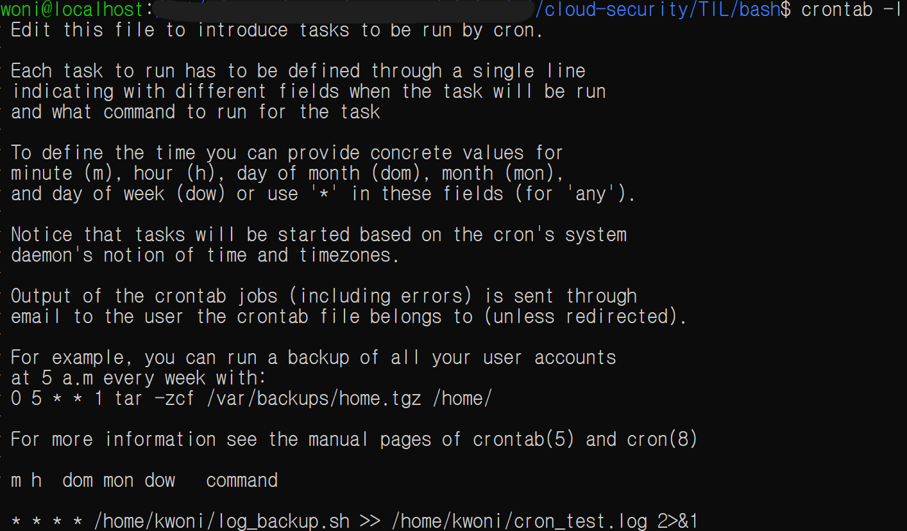
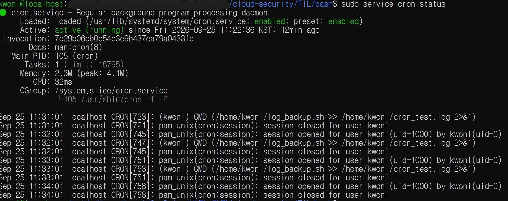
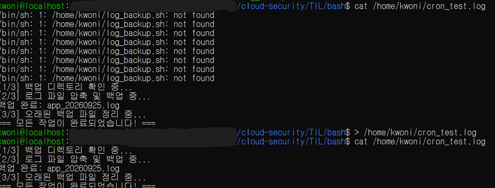

# Linux Cron / Crontab

**Date:** 2026-09-25
**Category:** Linux / Automation

## 1. 학습 목표

Linux의 `cron`과 `crontab`을 이용하여 특정 작업을 주기적으로 실행하는 방법을 익히고, 등록한 작업이 실제로 실행되는지 로그를 통해 확인함.

---

## 2. 학습 내용

### 2.1 Cron / Crontab

`cron`은 Linux에서 정해진 시간이나 주기에 맞춰 작업을 자동으로 실행하는 기능.

`crontab`을 이용하여 실행할 작업과 실행 주기를 등록할 수 있음.

오늘은 직접 작업을 등록하고 실행 여부와 로그를 확인한 뒤, 테스트가 끝난 후 등록한 작업을 삭제하는 과정까지 진행.

### 2.2 Crontab 실행 주기

다음과 같은 Crontab 설정을 사용하여 `log_backup.sh`를 매 1분마다 실행하도록 설정.

```cron
* * * * * /home/kwoni/log_backup.sh >> /home/kwoni/cron_test.log 2>&1
```

Crontab의 기본 실행 주기는 5개의 필드로 구성.

| 순서 | 필드               | 범위   | `*`의 의미 |
| -- | ---------------- | ---- | ------- |
| 1  | 분 (Minute)       | 0~59 | 매 분     |
| 2  | 시 (Hour)         | 0~23 | 매 시간    |
| 3  | 일 (Day of Month) | 1~31 | 매일      |
| 4  | 월 (Month)        | 1~12 | 매월      |
| 5  | 요일 (Day of Week) | 0~7  | 모든 요일 (0부터 순서대로 일 ~ 토요일까지 의미하며 7은 다시 일요일을 의미)   |

따라서 위 설정은 5개 필드가 모두 `*`이므로 **매 분마다 `log_backup.sh`를 실행**한다를 의미.

예시는 다음과 같다.

| Cron 표현식    | 실행 주기        |
| ----------- | ------------ |
| `* * * * *` | 매 분          |
| `0 * * * *` | 매시간 0분       |
| `0 9 * * *` | 매일 오전 9시     |
| `0 9 * * 1` | 매주 월요일 오전 9시 |
| `0 0 1 * *` | 매월 1일 자정     |

특정 범위를 지정할 경우에는 9-16 이런 식으로 -을 사용하여 범위를 지정할 수 있음.

### 2.3 명령어 및 출력 리다이렉션

Cron 설정의 뒷부분은 다음과 같이 구성.

```cron
/home/kwoni/log_backup.sh >> /home/kwoni/cron_test.log 2>&1
```

| 문법     | 의미                | 동작                       |
| ------ | ----------------- | ------------------------ |
| `>`    | 표준 출력 덮어쓰기        | 기존 파일 내용을 지우고 새로운 출력 저장  |
| `>>`   | 표준 출력 추가          | 기존 파일의 마지막에 출력 내용 추가     |
| `2>`   | 표준 오류 출력 저장       | 오류 메시지를 지정한 파일에 저장       |
| `2>>`  | 표준 오류 출력 추가       | 오류 메시지를 기존 파일에 추가        |
| `2>&1` | 표준 오류를 표준 출력으로 전달 | 오류 출력도 표준 출력과 같은 대상으로 보냄 |

따라서:

```cron
>> /home/kwoni/cron_test.log 2>&1
```

은 **일반 출력은 `cron_test.log`에 계속 추가하고, 오류 출력도 같은 파일에 추가**하는 설정.

이를 통해 Cron 작업의 정상 출력과 오류 내용을 하나의 로그 파일에서 확인할 수 있도록 구성.

---

## 3. Hands-on

### 3.1 Crontab 작성 및 확인

`crontab -e`를 사용하여 Cron 작업을 등록.

```bash
crontab -e
```

다음 작업을 등록.

```cron
* * * * * /home/kwoni/log_backup.sh >> /home/kwoni/cron_test.log 2>&1
```

등록된 Cron 작업은 `crontab -l`로 확인함.

```bash
crontab -l
```


생성한 Cron 작업이 정상 작동하는 지 확인

```bash
sudo service cron status
```


만약, Active 부분에 not running 이런 식으로 나올 경우에는 아래의 명령어로 Cron을 실행하면 됨

```bash
sudo service cron start
```

### 3.2 Cron 실행 및 로그 확인

등록한 작업이 주기적으로 실행되는 것을 확인하고, 생성된 로그 파일을 확인.

```bash
cat /home/kwoni/cron_test.log
```

Cron 작업의 실행 결과가 로그 파일에 기록되는 것을 확인.



### 3.3 Crontab 삭제

테스트가 끝난 후 `crontab -e`로 다시 편집기에 들어가 등록했던 아래 한 줄을 삭제.
혹은, 이전에 입력했던 Cron 작업 코드 앞에 #만 추가하여 주석처리만 해도 됨.

```bash
#* * * * * /home/kwoni/log_backup.sh >> /home/kwoni/cron_test.log 2>&1
```

---

## 4. Troubleshooting

### 4.1 Cron 로그 파일 확인 과정에서 `not found` 발생

다음 명령으로 Cron 로그 파일을 확인하려 했으나 파일을 찾을 수 없다는 메시지가 발생.

```bash
cat /home/kwoni/cron_test.log
```

이후 `log_backup.sh`의 실제 위치를 확인하기 위해 `realpath`를 사용.

```bash
realpath log_backup.sh
```

확인한 실제 경로를 바탕으로 로그 백업 Script를 `/home/kwoni` 홈 디렉터리로 복사하여, Crontab에 등록한 경로와 일치하도록 구성한 뒤 다시 실행.

```bash
cp ""/mnt/c/Users/<Windows_User>/.../log_backup.sh" ~/log_backup.sh
```

이를 통해 **Cron 설정에 작성한 Script 경로와 실제 Script 파일의 위치가 일치해야 하며, 파일이 예상한 위치에 있는지 직접 확인하는 과정이 필요하다**는 점을 경험함.

---

## 5. Assessment

다음 명령을 이용해 Crontab을 직접 관리할 수 있는지 확인.

```bash
crontab -e
crontab -l
```

또한 5개의 시간 필드를 이용해 Cron 실행 주기를 설정하고, Shell Script 실행 결과를 로그 파일로 확인하는 방법을 경험.

---

## 6. 오늘 배운 점

오늘은 `cron`과 `crontab`을 직접 사용하면서 Linux에서 반복적인 작업을 일정한 주기로 자동 실행할 수 있다는 기본적인 흐름을 경험함.

특히 Bash Script를 Cron과 연결하여 **기존에 작성한 Script를 정해진 주기에 맞춰 자동 실행할 수 있다는 점**을 확인함.

또한 Crontab의 5개 시간 필드가 각각 **분, 시, 일, 월, 요일**을 의미하며 `*`를 사용하면 해당 항목의 모든 값을 대상으로 한다는 것을 이해.

`>>`를 이용한 로그 추가 기록과 `2>&1`을 이용한 표준 오류 출력의 로그 저장 방식도 실제 설정에 사용해보았음.

---

## 7. Key Takeaway

오늘은 다음 흐름을 직접 경험함.

```text
Crontab 편집
  ↓
실행 주기 설정
  ↓
Cron 작업 등록
  ↓
주기적 실행
  ↓
로그 파일 기록
  ↓
로그 확인
  ↓
예약 작업 삭제
```

앞서 학습한 Bash Shell Script와 Cron을 연결하면서 **Linux에서 반복 작업을 자동 실행하고 실행 결과를 확인하는 기본적인 구조**를 직접 경험함.

또한 Cron 작업이 정상적으로 실행되지 않거나 로그가 예상대로 생성되지 않을 경우 **Crontab에 지정한 경로와 실제 파일 위치를 확인하는 것이 중요하다는 점**을 경험함.

---

## 8. Next

Bash Shell Script의 인자 전달($1, $2), 종료 상태 코드($?), 환경 변수(export) 등 간단한 스크립트 재사용 방법을 학습 예정.

이후 SSH, IP, Port 등 Linux 환경에서 사용하는 기본적인 네트워크 개념을 확인하고, Linux 학습을 필요한 범위에서 마무리한 뒤 Docker의 이미지와 컨테이너 개념으로 진행 예정.

