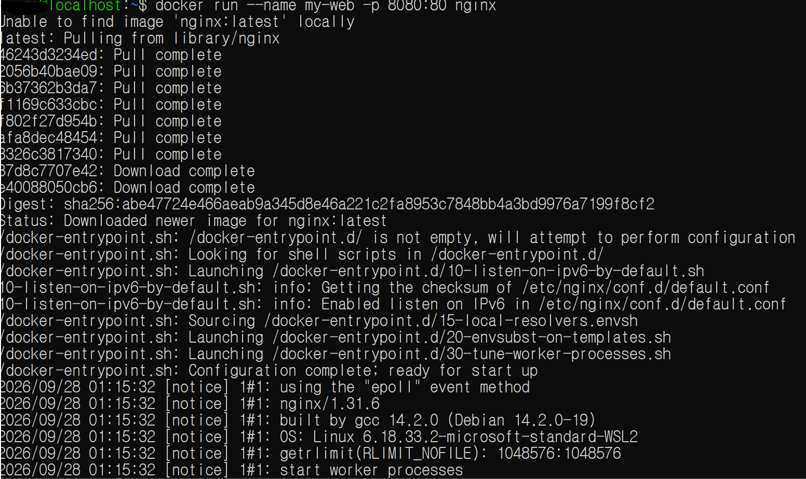
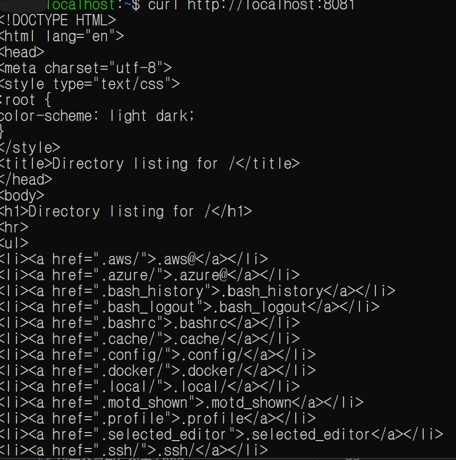
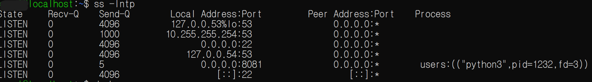
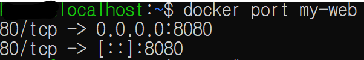
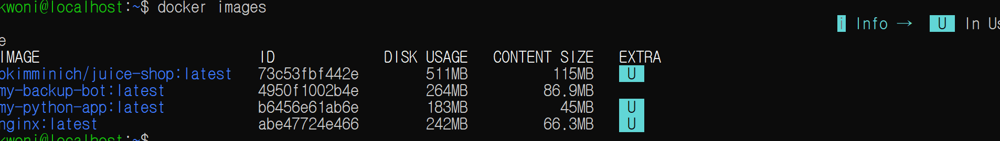
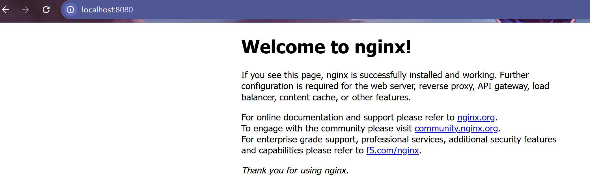
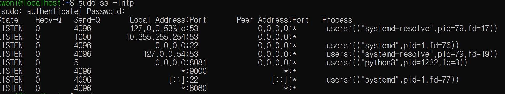

# Network 기본 실습 — IP, Port, localhost, Docker Port Mapping

Date: 2026-09-28  
Category: Network / Docker / Linux

## 1. 학습 목표

Linux 및 Docker 환경에서 Network의 기본 개념인 IP, Port, `localhost`를 확인하고 실제 서비스에 접근하는 과정 실습.

Docker Container의 Port Mapping을 확인하고, Python HTTP Server를 직접 실행하여 특정 Port에서 서비스가 동작하는 과정 확인.

또한 Docker 및 WSL 환경에서 발생한 Port 접근 및 실행 관련 문제를 Troubleshooting하면서 Network 상태를 확인하는 방법을 익힘.

* * *

## 2. 학습 내용

### 2.1 IP Address와 Port

Network 통신에서는 접속 대상의 주소와 서비스를 구분하기 위해 IP Address와 Port 사용.

```text
IP Address
→ 어느 환경/호스트에 접근할 것인지 식별

Port
→ 해당 환경에서 어느 서비스와 통신할 것인지 식별
```

예:

```text
127.0.0.1:8081
```

- `127.0.0.1` → Loopback Address
- `8081` → 접속할 Port

---

### 2.2 localhost

`localhost`는 현재 접근하고 있는 환경 자신을 가리키는 주소로 사용.

Docker 실습에서 Container 내부의 `localhost`와 Host의 `localhost`가 동일하지 않았던 것처럼, **어떤 환경에서 명령을 실행하고 있는지에 따라 `localhost`가 가리키는 대상이 달라질 수 있음**을 확인.

---

### 2.3 Docker Port Mapping

Nginx Container를 다음과 같이 실행.

```bash
docker run --name my-web -p 8080:80 nginx
```

`-p 8080:80`은 Host의 `8080` Port와 Container의 `80` Port를 연결하는 설정.

```text
Host :8080
   ↓
Container :80
   ↓
Nginx
```

이를 통해 Container 내부에서 사용하는 Port와 Host에서 접근하는 Port가 서로 다를 수 있다는 점을 확인.



---

### 2.4 Python HTTP Server

Docker와 별도로 Linux 환경에서 Python의 기본 HTTP Server를 실행.

```bash
python3 -m http.server 8081
```

실행 후 다른 터미널에서:

```bash
curl http://localhost:8081
```
접속을 확인했으나 연결되지 않는 현상이 발생.

이후 Binding Address를 명시하여 다시 실행.

```bash
python3 -m http.server 8081 --bind 0.0.0.0
```

다시:

```bash
curl http://localhost:8081
```

실행하여 HTML 형식의 HTTP 응답을 확인.

첫 번째 실행이 실패한 정확한 원인은 당시 환경에서 별도로 확인하지 못했으며, --bind 0.0.0.0으로 다시 실행한 뒤 정상 응답을 확인함.



---

### 2.5 `curl`과 HTTP 응답 확인

`curl`을 이용하여 직접 HTTP 요청을 보내고 응답을 확인.

```bash
curl http://localhost:8081
```

Python HTTP Server는 현재 실행한 디렉터리의 내용을 HTML 형태로 반환하므로, `curl` 실행 결과로 HTML 내용이 출력되는 것을 확인.

이를 통해:

```text
localhost
   ↓
8081 Port
   ↓
Python HTTP Server
   ↓
HTTP Request
   ↓
HTML Response
```

흐름을 직접 확인.

---

### 2.6 Network 상태 확인 명령

Network 및 Port 상태를 확인하기 위해 다음 명령 사용.

```bash
ss -lntp
```



Docker의 Port Mapping은 다음 명령을 통해 확인.

```bash
docker port <container-name>
```



이를 통해 Linux 프로세스의 Listening 상태와 Docker가 관리하는 Port Mapping 정보를 구분하여 확인.

### 2.7 미사용 Docker Container 삭제

미사용 Docker Container는 아래와 같은 방법으로 삭제.

```bash
docker stop my-web 
docker rm my-web
```

실행 중인 Container를 강제로 중지하고 삭제해야 하는 경우:

```bash
docker rm -f my-web
```

`docker rm`은 Container만 삭제하므로 해당 Image는 그대로 유지됨.

현재 Docker 리소스 상태를 확인하려면:
```bash
docker ps # 실행 중인 Container
docker ps -a # 전체 Container
docker images # 도커 Image
```



Image까지 삭제하려면 Image 이름을 확인한 후, :
```bash
docker images
```

아래 커맨드를 입력하여 Image를 삭제
```bash
docker rmi <image-name>
```

---

## 3. Hands-on

### 3.1 Docker Nginx Port Mapping

```bash
docker run --name my-web -p 8080:80 nginx
```

Host의 `8080` Port와 Container의 `80` Port를 연결.



---

### 3.2 Python HTTP Server

```bash
python3 -m http.server 8081 --bind 0.0.0.0
```

Python 기본 HTTP Server 실행.

다른 터미널에서:

```bash
curl http://localhost:8081
```

실행하여 HTML 응답 확인.

---

### 3.3 Docker Port 상태 확인

```bash
docker port my-web
```

Docker Container의 Port Mapping 상태 확인.


---

### 3.4 Linux Port 상태 확인

```bash
sudo ss -lntp
```

Linux 환경에서 현재 Listening 중인 Port를 확인.



---

## 4. Troubleshooting

### 4.1 Docker 명령어 미인식 에러 (`The command 'docker' could not be found`)

- **상황:** WSL2(Ubuntu) 터미널에서 `docker run` 명령어를 실행했으나 Docker를 찾을 수 없다는 오류가 발생.
- **원인:** Docker Desktop은 설치되어 있었지만 현재 사용 중인 WSL 배포판과 Docker Desktop의 WSL Integration이 활성화되지 않은 상태였음.
- **조치:**
  - Docker Desktop `Settings → Resources → WSL Integration`에서 사용 중인 Ubuntu 배포판의 연동을 활성화.
  - 이후 WSL 터미널을 다시 실행하여 `docker` 명령어가 정상적으로 인식되는 것을 확인.

---

### 4.2 터미널 창 독점 현상 (서버 실행 후 커맨드 입력 불가)

- **상황:** Python HTTP Server 또는 Docker Container를 실행한 뒤 기존 터미널에서 다시 커맨드를 입력할 수 없었음.
- **원인:** 서버 또는 Container가 포그라운드(Foreground) 상태로 실행되어 해당 터미널을 점유하고 있었음.
- **조치:**
  - `Ctrl + C`를 사용하여 포그라운드로 실행 중인 프로세스를 종료하고 프롬프트를 복구.
  - Docker Container는 필요에 따라 `-d` 옵션을 사용하여 백그라운드(Detached)로 실행할 수 있음.
  - 실습에서는 서버 실행용 터미널과 명령어 입력용 터미널을 분리하여 사용.

---

### 4.3 WSL 환경에서 Port 상태 확인 결과 차이 (`ss -lntp`)

- **상황:** Docker에서 Host Port와 Container Port를 매핑했지만 WSL Ubuntu에서 `ss -lntp`로 확인했을 때 예상한 Port가 일반적인 Linux 프로세스의 LISTEN 상태처럼 보이지 않았음.
- **원인:** Docker Desktop의 WSL2 환경에서는 Container의 Port Publishing이 일반적인 WSL 내부 프로세스의 Listening Socket과 동일한 형태로 보이지 않을 수 있음.
- **조치:**
  - Docker의 Port Mapping 상태는 다음 명령으로 직접 확인.

```bash
docker port <container-name>
```

  - Windows Host 측의 Port 상태를 확인해야 하는 경우 CMD에서 다음 명령을 사용.

```cmd
netstat -ano | findstr :<포트번호>
```

이를 통해 `ss` 결과만으로 판단하지 않고 Docker 자체의 Port Mapping 정보와 Host 측 Port 상태를 각각 확인하는 방법을 익힘.

---

### 4.4 Python HTTP Server 연결 실패

- **상황:** 다음 명령으로 Python HTTP Server를 실행한 뒤:

```bash
python3 -m http.server 8081
```

다른 터미널에서:

```bash
curl http://localhost:8081
```

실행했으나 연결되지 않음.

- **조치:**
  - Binding Address를 명시하여 Server를 다시 실행.

```bash
python3 -m http.server 8081 --bind 0.0.0.0
```

  - 이후:

```bash
curl http://localhost:8081
```

  실행 결과 HTML 응답 확인.

 `--bind 0.0.0.0`으로 다시 실행한 뒤 `curl`에서 정상적인 HTTP 응답을 확인함. 첫 번째 실행 실패의 정확한 원인은 특정하지 못함.

---

### 4.5 Browser에서는 접속되지 않았으나 `curl`에서는 응답 확인

Python HTTP Server가 실행된 이후 Browser에서 `localhost:8081` 접속 시 연결되지 않았지만, WSL 터미널에서:

```bash
curl http://localhost:8081
```

실행 시 HTML 응답을 확인.

이번 실습에서는 `curl`을 이용해 **HTTP Server 자체가 정상적으로 동작하고 있는지 먼저 확인**하고, Browser 접근 여부와 Server 자체의 정상 동작 여부를 분리해서 확인하는 과정을 경험.

---

## 5. Assessment

오늘 실습을 통해 다음 Network 요소를 직접 연결해서 확인.

```text
IP
 ↓
Port
 ↓
Service
 ↓
HTTP Request
 ↓
HTTP Response
```

Docker에서는:

```text
Host:8080
 ↓
Port Mapping
 ↓
Container:80
 ↓
Nginx
```

Linux 환경에서는:

```text
localhost:8081
 ↓
Python HTTP Server
 ↓
curl
 ↓
HTML Response
```

형태로 서비스를 접근.

또한 실제 오류를 통해 Docker, WSL, Linux 환경마다 Port 상태를 확인하는 방법이 달라질 수 있다는 점을 확인.

* * *

## 6. 오늘 배운 점

오늘은 Network의 기본적인 IP, Port, `localhost` 개념을 Docker와 Linux 환경에서 직접 확인.

Docker에서는:

```bash
docker run --name my-web -p 8080:80 nginx
```

를 통해 Host Port와 Container Port를 연결하고, Docker Port Mapping의 기본 구조를 확인.

Linux 환경에서는 Python HTTP Server를 실행하고 `curl`을 통해 실제 HTTP 응답을 확인하면서 특정 Port에서 서비스가 동작하는 과정을 직접 경험.

또한 Docker CLI가 인식되지 않는 문제, 포그라운드 프로세스로 인해 터미널이 점유되는 문제, WSL 환경에서 `ss`만으로 Docker Port 상태를 확인하기 어려웠던 문제 등을 직접 해결.

이를 통해 Network 문제를 확인할 때 단순히 "접속이 안 된다"에서 끝나는 것이 아니라:

```text
1. 서비스가 실행 중인가?
2. 어떤 Port를 사용하고 있는가?
3. 어떤 주소에 Bind되어 있는가?
4. 현재 명령을 실행하는 환경은 어디인가?
5. Docker라면 Port Mapping은 어떻게 되어 있는가?
```

와 같이 단계적으로 확인해야 한다는 점을 학습.

* * *

## 7. Key Takeaway

오늘의 핵심은 Network 개념을 암기하는 것보다 **서비스가 어느 주소와 Port에서 동작하고 있는지 확인하고, 실제 요청이 전달되는 경로를 확인하는 것**.

```text
IP
→ 어느 환경에 접근하는가

Port
→ 어느 서비스에 접근하는가

localhost
→ 현재 환경 자신을 가리킴

Bind
→ 서비스가 어느 주소에서 요청을 받을지 결정

Docker Port Mapping
→ Host Port와 Container Port를 연결

curl
→ 실제 HTTP 요청을 보내 응답 확인

ss / docker port
→ Port 상태와 Mapping 상태 확인
```

특히 Docker와 Linux에서 동일한 Port 개념을 사용하더라도 실행 환경에 따라 확인 방법과 접근 방식이 달라질 수 있다는 점을 직접 경험.

* * *

## 8. Next

Docker Network의 기본 개념을 바탕으로 Docker Compose를 통해 여러 Container를 구성하고 관리하는 방법을 학습.

이후 GitHub Actions를 이용해 Docker Build 및 테스트 과정을 자동화하는 CI/CD 기초를 실습.