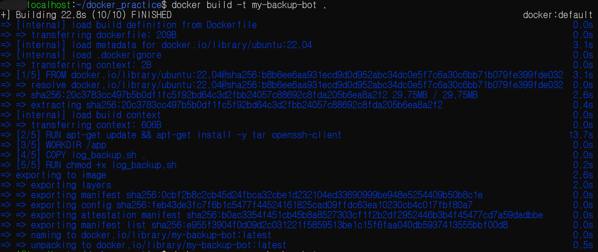
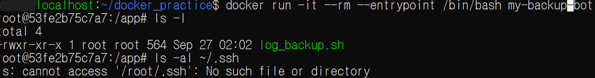
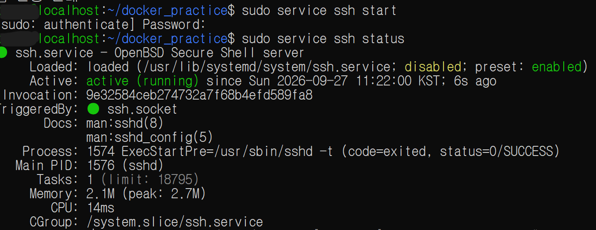
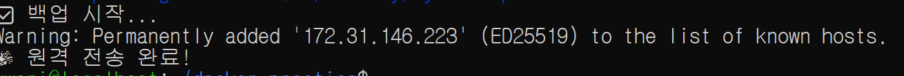
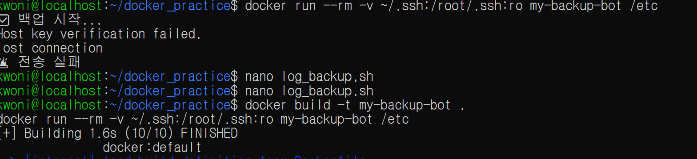

# Docker 기본 실습 — Dockerfile, Container, Bind Mount, Network

Date: 2026-09-27
Category: Docker / Linux / SSH

## 1. 학습 목표

- Dockerfile을 작성하고 Docker Image를 직접 빌드.
- Image와 Container의 관계 이해.
- Container의 격리성과 Host와의 차이 확인.
- Bind Mount를 이용해 Host의 SSH 환경을 Container에 연결.
- Container에서 SSH/SCP를 이용해 파일 전송.
- localhost, Host IP, SSH Host Key 문제를 직접 확인하고 해결.
---

## 2. 학습 내용
### 2.1 Dockerfile 작성

기존에 작성한 log_backup.sh를 Docker Container에서 실행하기 위해 Dockerfile 작성
```DockerFile
FROM ubuntu:22.04
RUN apt-get update && apt-get install -y tar openssh-client
WORKDIR /app
COPY log_backup.sh .
RUN chmod +x log_backup.sh
ENTRYPOINT ["./log_backup.sh"]
```

각 명령어 역할:

| 명령                           | 의미                              |
| ---------------------------- | ------------------------------- |
| `FROM ubuntu:22.04`          | Ubuntu 22.04 기반 Image 사용        |
| `RUN apt-get ...`            | `tar`, `openssh-client` 설치      |
| `WORKDIR /app`               | Container의 작업 디렉터리를 `/app`으로 설정 |
| `COPY log_backup.sh .`       | 백업 Script를 Image 내부로 복사         |
| `RUN chmod +x log_backup.sh` | Script 실행 권한 부여                 |
| `ENTRYPOINT [...]`           | Container 실행 시 기본적으로 Script 실행  |

Dockerfile을 이용해 Image 생성
```bash
docker build -t my-backup-bot .
```

실제 Build 과정에서 Ubuntu Image를 가져오고 필요한 패키지를 설치한 뒤 Script를 복사하고 실행 권한을 부여하는 과정 확인


---

### 2.2 Docker Image와 Container

생성한 Image를 이용해 Container 실행
```bash
docker run --rm my-backup-bot
```

인자를 전달하지 않자 기존 log_backup.sh의 입력값 검증에 의해 다음 오류가 발생

```bash
❌ 에러: 경로를 입력해주세요!
```

이후 백업 대상 경로를 전달 후 다시 실행

이때 Container 안에서 log_backup.sh가 정상적으로 실행되어 백업 작업이 시작되는 것을 확인했으나, ssh 연결 단계에서 문제 발생하며 아래 에러 메시지 출력
```bash
✅ 백업 시작...
ssh: connect to host localhost port 22: Connection refused
lost connection
🚨 전송 실패
```
---

### 2.3 Container 내부 환경 확인

실행 중인 Container의 내부 환경을 직접 확인하기 위해 Bash Shell로 진입
```bash
docker run -it --rm --entrypoint /bin/bash my-backup-bot
```

Container 내부에서 /app을 확인했을 때 Dockerfile의 COPY 명령으로 가져온 log_backup.sh가 존재하는 것을 확인



반면 SSH 설정 및 키가 있는지 확인하기 위해:
```bash
ls -al ~/.ssh
```

를 실행했을 때 다음과 같이 에러 메시지가 출력되었으며, 이는 SSH 디렉터리가 존재하지 않았음을 의미
```bash
ls: cannot access '/root/.ssh': No such file or directory
```

이를 통해 Container 내부의 파일시스템과 Host의 파일시스템은 기본적으로 분리되어 있으며, Host의 파일이나 설정이 Container에 자동으로 공유되는 것은 아니라는 점을 확인
---

### 2.4 Bind Mount

Host의 SSH 환경을 Container에서 사용할 수 있도록 다음 옵션 사용
```bash
-v ~/.ssh:/root/.ssh:ro
```

의미는 아래와 같음

| 구성           | 의미                    |
| ------------ | --------------------- |
| `~/.ssh`     | Host의 SSH 디렉터리        |
| `/root/.ssh` | Container 내부에서 연결할 위치 |
| `:ro`        | 읽기 전용(Read Only)으로 연결 |

구조는 다음과 같음

```text
Host
~/.ssh
   │
   │ Bind Mount
   ▼
Container
/root/.ssh
```

이번 실습에서 사용한 -v는 Host의 실제 디렉터리를 Container에 연결하는 Bind Mount 방식임.

ro 옵션을 통해 Container가 해당 SSH 파일을 수정하지 못하도록 읽기 전용으로 연결.
---

### 2.5 Container의 Network와 localhost

처음 Container에서 백업 Script를 실행했을 때 다음 오류 발생
```bash
ssh: connect to host localhost port 22: Connection refused
lost connection
🚨 전송 실패
```

Host에서는 SSH 서비스가 실행되고 있는지 확인
```bash
sudo service ssh status
```

SSH 서비스가 active (running) 상태이고 22번 포트에서 대기하고 있는 것을 확인


또한 Host 환경에서는:
```bash
ssh localhost
```
로 정상적으로 SSH 접속이 가능했으나, 그런데 Container에서는 계속 Connection refused 발생

#### 원인

Container에서 localhost는 Host가 아니라 현재 실행 중인 Container 자신을 의미
따라서 Container 내부에서
```bash
localhost:22
```
에 접속하면 Host의 SSH 서버가 아니라 Container 자신의 22번 포트에 연결을 시도함

이 문제를 확인하는 과정에서 --network host도 사용해봤지만 동일하게 연결 거부됨
```bash
docker run --rm \
  -v ~/.ssh:/root/.ssh:ro \
  --network host \
  my-backup-bot /etc
```

이를 통해 단순히 Host의 SSH 서비스가 실행 중인지 여부만으로 Container에서의 접속이 해결되는 것은 아니며, Container가 실제로 어떤 주소를 대상으로 통신하는지를 확인해야 한다는 점을 확인

이후 Host의 실제 IP 주소를 대상으로 SSH/SCP가 연결되도록 log_backup.sh의 네트워크 경로 수정
---

### 2.6 SSH Host Key 문제

Network 경로를 수정한 뒤에는 다음 문제가 발생
```bash
Host key verification failed.
lost connection
🚨 전송 실패
```

Host에서 ssh localhost를 처음 실행했을 때와 마찬가지로 SSH에는 접속 대상의 Host Key를 확인하는 과정이 존재

하지만 Container는 Host와 별도의 환경이므로 기존 Host의 SSH 환경과 동일한 known_hosts 정보를 가지고 있지 않았음.

자동화 환경에서 최초 SSH 접속 시 Host Key 확인으로 Script가 멈추는 상황을 피하기 위해 다음 옵션도 확인.
```bash
-o StrictHostKeyChecking=no
```

이 옵션을 사용하면 최초 접속 시 대화형 Host Key 확인을 생략 가능하지만,
Host Key 검증을 생략하는 방식이므로 실제 운영 환경에서는 보안상 주의가 필요함.

최종 실행에서는 Host Key가 등록된 뒤 SCP 전송까지 성공



### 2.7 Container 내부에서 Docker 명령어 실행

Container 내부에서 Docker 명령어를 직접 실행해 봄
```bash
docker run -it --rm --entrypoint /bin/bash my-backup-bot
```

다음 오류 발생
```bash
bash: docker: command not found
```

Container 내부 환경에는 Host에서 사용하는 Docker CLI가 자동으로 존재하지 않는다는 것을 확인함.
 - Docker 명령어를 실행하려면 Container를 종료하고 실행해야 함.

이를 통해 Host에서 Docker를 관리하는 환경과 Container 내부 실행 환경은 별개라는 점을 확인함.
---

### 2.8 Container → SSH/SCP 파일 전송

최종적으로 Docker Container에서 백업 Script를 실행하고 SSH/SCP를 이용하여 Host로 파일을 전송함

최종 실행 결과:


이를 통해 다음 작업 흐름을 하나의 환경에서 연결

```text
Container 실행
      ↓
백업 대상 경로 전달
      ↓
tar를 이용한 백업 파일 생성
      ↓
SSH 연결
      ↓
SCP 파일 전송
      ↓
전송 성공 확인
```
---

## 3. Hands-on

### 3.1 Docker Image 생성
```bash
docker build -t my-backup-bot .
```
Ubuntu 22.04 기반 Image 생성 성공.

### 3.2 Container 실행
```bash
docker run --rm my-backup-bot /etc
```
기존 log_backup.sh 실행 확인.

### 3.3 Container 내부 확인
```bash
docker run -it --rm --entrypoint /bin/bash my-backup-bot
```
Container 내부의 /app과 ~/.ssh를 확인하여 Host와 Container의 환경 차이를 확인.

### 3.4 SSH Bind Mount

```bash
docker run --rm \
  -v ~/.ssh:/root/.ssh:ro \
  my-backup-bot /etc
```
Host의 SSH 디렉터리를 Container에 읽기 전용으로 연결.

### 3.5 SSH/SCP 연결

Host의 SSH 서비스 상태를 확인하고 Container에서 Host의 IP 주소를 대상으로 SSH/SCP 연결을 시도.

최종적으로 백업 파일 전송 성공.
```bash
✅ 백업 시작...
🎉 원격 전송 완료!
```
---

## 4. Troubleshooting

### 4.1 Connection refused
```bash
ssh: connect to host localhost port 22: Connection refused
```

확인한 내용

- Host의 SSH 서비스 상태 확인
- Host에서 ssh localhost 정상 동작 확인
- Container 내부에서 localhost가 Host를 가리키지 않는다는 점 확인
--network host도 테스트
- 최종적으로 Host의 IP 주소를 대상으로 접속하도록 수정

핵심

Container의 localhost와 Host의 localhost는 동일하지 않음

### 4.2 Host key verification failed

```bash
Host key verification failed
Host key verification failed.
```

원인

Container는 Host와 별도의 환경이므로 SSH Host Key 확인 정보가 준비되어 있지 않았음

해결 과정

- Host Key 확인 과정 파악
- 자동화 환경에서 StrictHostKeyChecking=no 옵션 확인
- 최종적으로 Host Key가 등록된 뒤 SCP 전송 성공
---

### 4.3 /root/.ssh 없음

```bash
ls: cannot access '/root/.ssh': No such file or directory
```

원인

Container가 Host의 .ssh 디렉터리를 자동으로 공유하지 않음.

해결

```bash
docker run --rm -v ~/.ssh:/root/.ssh:ro my-backup-bot /etc
```
Bind Mount 사용.

### 4.4 Container 내부에서 docker 명령어 없음
```bash
bash: docker: command not found
```

원인

Container 내부에는 Docker CLI가 자동으로 존재하지 않음.

확인한 내용

Host의 Docker 환경과 Container 내부 실행 환경은 별개의 환경이라는 점 확인

해결

Container에서 exit 커맨드를 입력 후 Contatiner를 종료하고 해당 커맨드 다시 입력
---

## 5. Assessment

오늘 실습을 통해 다음 흐름을 직접 수행

```text
Dockerfile 작성
↓
docker build
↓
Image 생성
↓
Container 실행
↓
Container 내부 환경 확인
↓
Bind Mount 구성
↓
Network 문제 발생
↓
localhost와 Host의 차이 확인
↓
Host IP를 통한 접근
↓
SSH Host Key 문제 해결
↓
SCP 파일 전송 성공
```

처음에는 Container에서 SSH 연결이 되지 않았지만, SSH 서비스 상태와 Container 환경을 각각 확인하고 문제를 단계적으로 좁혀 최종적으로 Container에서 파일을 전송하는 것까지 성공
---

## 6. 오늘 배운 점

오늘은 Dockerfile을 이용해 Ubuntu 기반의 Image를 직접 만들고, 이를 Container로 실행하는 기본 흐름을 실습

특히 기존에 작성했던 Bash Script를 Docker Container에서 직접 실행하면서 “Host에서 실행되는 것”과 “Container 안에서 실행되는 것”이 다르다는 점을 실제 오류를 통해 확인함.

Container 내부에서 Host의 .ssh 디렉터리가 보이지 않았던 문제를 통해 Container의 격리성을 확인했고, Bind Mount를 이용하면 필요한 Host 파일이나 디렉터리를 Container와 연결할 수 있다는 것도 확인함.

또한 localhost를 이용한 SSH 연결이 실패한 과정을 통해 Container의 localhost는 Host가 아니라 Container 자신을 가리킨다는 점을 이해함.

이후 Host의 SSH 서비스 상태를 확인하고 실제 IP 주소를 이용해 접근하면서 Network 문제를 해결했으며, 이어서 Host key verification failed 문제를 통해 SSH Host Key 확인 과정과 자동화 환경에서의 처리 방법도 경험함.

마지막으로 Container에서 백업 Script를 실행하여 압축 파일을 생성하고, SSH/SCP를 통해 파일을 전송하는 것까지 성공했음.
---

## 7. Key Takeaway

오늘 Docker 실습에서 가장 중요했던 것은 Docker 명령어 자체를 외우는 것이 아니라 Container가 독립된 실행 환경이라는 점을 실제 문제를 통해 이해

```text
Image
↓
Container
↓
Container 내부 파일시스템
↓
Bind Mount
↓
Container Network
↓
SSH
↓
SCP
```

특히 다음 세 가지를 기억할 것

1. Container의 localhost는 Host의 localhost와 다름.

2. Host의 파일이나 설정은 Container에 자동으로 공유되지 않으며, 필요한 경우 Bind Mount 등을 사용해야 함.

3. Container에서 외부 서버와 통신할 때는 Network뿐만 아니라 SSH 인증 및 Host Key 문제도 함께 고려해야 함.

오늘은 Docker의 모든 기능을 학습한 것이 아니라, Dockerfile로 Image를 만들고 Container를 실행한 뒤 외부 파일과 네트워크를 연결해 실제 작업을 수행하는 기본 흐름을 경험한 것으로 정리.
---

## 8. Next

Docker Network의 기본 개념(IP, Port, localhost)을 학습한 후 Docker Compose를 통해 여러 Container를 관리하는 방법 실습.

이후 GitHub Actions를 활용한 Docker Build 자동화 및 CI/CD 기초를 학습하고, 마지막으로 Kubernetes의 기본 개념을 살펴볼 예정.


