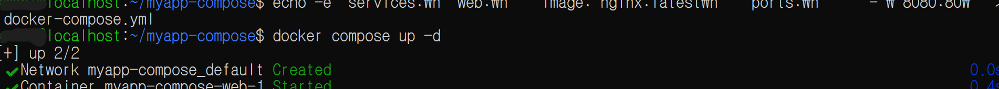
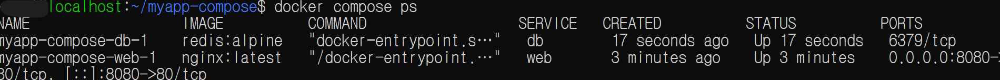
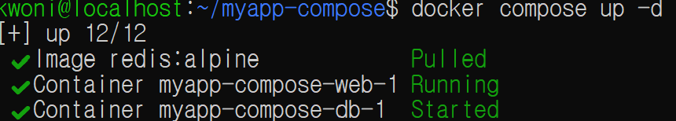
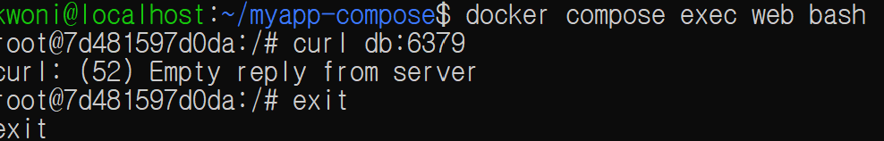
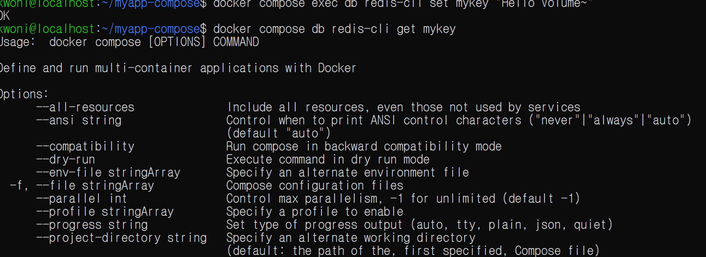
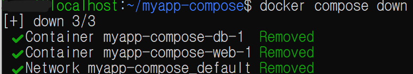
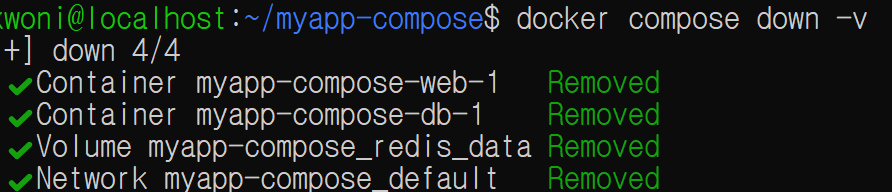
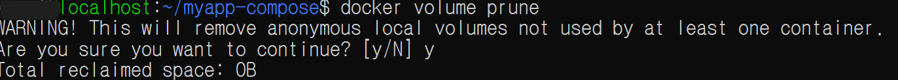

# Docker Compose 및 Volume · Bind Mount 실습

Date: 2026-09-29  
Category: Docker / Docker Compose / Network / Storage

## 1. 학습 목표

Docker Compose를 이용하여 여러 Container를 하나의 구성으로 관리하는 방법을 학습.

Compose에서 생성되는 기본 Network를 통해 Container 간 통신 구조를 확인하고, Named Volume을 이용해 Container의 데이터를 별도로 저장하는 방법을 실습.

또한 Bind Mount를 이용하여 Host의 파일을 Container에서 사용하는 방법을 확인하고, Host에서 파일을 수정한 내용을 Nginx Container에 반영.

---

## 2. 학습 내용

### 2.1 Docker Compose 기본

Docker Compose는 여러 Container와 관련 설정을 YAML 파일로 정의하고 한 번에 생성 및 실행할 수 있도록 관리하는 도구.

Compose에서는 `docker-compose.yml` 또는 `compose.yaml`과 같은 YAML 파일에 Service, Image, Port, Volume 등의 설정을 정의하고 이를 기준으로 Container를 생성하고 실행할 수 있음.

예:

```yaml
services:
  web:
    image: nginx:latest
    ports:
      - "8080:80"
```

`docker run`을 사용할 경우 Container를 실행할 때마다 필요한 옵션을 직접 작성해야 하지만, Compose에서는 실행에 필요한 설정을 YAML 파일에 미리 작성해둘 수 있음.

따라서 동일한 구성으로 다시 실행하거나 여러 Service의 설정을 한 파일에서 함께 관리하기 편함.

다음 명령으로 Compose 설정을 기준으로 Container를 실행.

```bash
docker compose up -d
```

실행 과정에서 Compose가 기본 Network를 생성하고 `web` Container를 생성하는 것을 확인.

```text
Network myapp-compose_default Created
Container myapp-compose-web-1 Started
```



또한:

```bash
docker compose ps
```

를 통해 Compose가 관리하는 Container와 Port 상태를 확인.



---

### 2.2 Multi-Container 구성

기존 `web` Service에 Redis를 `db` Service로 추가.

```yaml
services:
  web:
    image: nginx:latest
    ports:
      - "8080:80"

  db:
    image: redis:alpine
```

다시:

```bash
docker compose up -d
```

를 실행하여 Nginx와 Redis 두 개의 Container를 함께 실행.

```bash
docker compose ps
```

실행 결과:

```text
myapp-compose-db-1    redis:alpine
myapp-compose-web-1   nginx:latest
```




두 개의 Service를 하나의 Compose 설정에서 함께 관리할 수 있음을 확인. :contentReference[oaicite:2]{index=2}

---

### 2.3 Container 간 통신

실행 중인 `web` Container 내부에 접속.

```bash
docker compose exec web bash
```

Container 내부에서 Redis Service에 접근하기 위해:

```bash
curl db:6379
```

를 실행.

```text
curl: (52) Empty reply from server
```
가 발생.

이를 통해 Compose 환경에서 다른 Service를 `db`라는 Service 이름으로 접근하는 시도를 확인.

다만 `curl`은 HTTP 요청을 사용하는 도구이고 Redis는 Redis 프로토콜을 사용하므로, 위 결과만으로 Redis와의 정상적인 통신을 확인한 것은 아님.

Redis의 데이터 저장 및 조회는 Redis CLI를 이용하여 확인.



---

### 2.4 Docker Volume 기본 개념

Container는 기본적으로 Container 내부의 파일시스템을 사용하므로,
Container가 삭제되면 Container 내부에 저장된 데이터도 함께 사라질 수 있음.

이처럼 Container의 생명주기와 별도로 데이터를 관리하기 위해 Docker에서는 Volume을 사용할 수 있음.

Docker에서는 크게 다음과 같은 방식으로 데이터를 연결할 수 있음.

| 방식 | 설명 |
| --- | --- |
| **Named Volume** | Docker가 직접 관리하는 저장 공간. Container와 분리하여 데이터를 보관할 수 있음 |
| **Bind Mount** | Host의 특정 파일이나 디렉터리를 Container 내부 경로에 직접 연결 |

---

### 2.5 Docker Named Volume

Redis의 데이터를 Container와 별도로 관리하기 위해 Named Volume을 추가.

```yaml
services:
  web:
    image: nginx:latest
    ports:
      - "8080:80"

  db:
    image: redis:alpine
    volumes:
      - redis_data:/data

volumes:
  redis_data:
```

Compose를 실행하면 Docker가 `redis_data` Volume을 생성.

```bash
docker compose up -d
```

실행 결과:

```text
Volume myapp-compose_redis_data Created
```

Redis에 데이터를 저장.

```bash
docker compose exec db redis-cli set mykey "Hello Volume~"
```

결과:

```text
OK
```

다시 조회:

```bash
docker compose exec db redis-cli get mykey
```



결과:

```text
"Hello Volume~"
```

Named Volume을 Redis의 `/data` 경로에 연결하고 데이터를 저장 및 조회하는 과정을 확인. :contentReference[oaicite:3]{index=3}

---

### 2.6 Docker Compose 주요 명령

이번 실습에서 사용한 주요 Compose 명령.

```bash
docker compose up -d
```

Compose 파일을 기준으로 Service를 생성하고 백그라운드에서 실행.

```bash
docker compose ps
```

Compose가 관리하는 Container 상태 확인.

```bash
docker compose exec <service> <command>
```

실행 중인 Service Container 내부에서 명령 실행.

```bash
docker compose down
```

Container와 Compose에서 생성한 Network를 제거.




```bash
docker compose down -v
```

Container와 Network뿐만 아니라 Compose에서 생성한 Named Volume까지 삭제.



실제 `down -v` 실행 후:

```bash
docker volume ls
```

를 통해 해당 Volume이 삭제된 것을 확인. :contentReference[oaicite:4]{index=4}


---

## 3. Bind Mount

### 3.1 Host 파일을 Container에 연결

Named Volume과 별도로 Host에서 직접 관리하는 파일을 Container에 연결하기 위해 Bind Mount를 사용.

Host에서 `html` 디렉터리를 생성하고:

```bash
mkdir html
```

Nginx에서 보여줄 HTML 파일 작성.

```bash
echo "<h1>Hello from Host Computer!</h1>" > html/index.html
```

Compose 설정:

```yaml
services:
  web:
    image: nginx:latest
    ports:
      - "8080:80"
    volumes:
      - ./html:/usr/share/nginx/html
```

Host의 `./html` 디렉터리와 Nginx Container의 웹 루트 경로를 연결.

```text
Host
./html
   │
   │ Bind Mount
   ▼
Container
/usr/share/nginx/html
```

Compose 실행:

```bash
docker compose up -d
```

Host에서 관리하는 HTML 파일을 Container 내부 Nginx가 웹 파일로 사용할 수 있도록 구성. :contentReference[oaicite:5]{index=5}

Host의 HTML 파일을 수정하면서 동일한 Port에서 변경된 내용이 Nginx 페이지에 반영되는 것도 확인.


---

## 4. Hands-on

### 4.1 Compose로 Nginx 실행

```bash
docker compose up -d
docker compose ps
```

Nginx Container 실행 및 상태 확인.

### 4.2 Redis 추가

```yaml
services:
  web:
    image: nginx:latest
    ports:
      - "8080:80"

  db:
    image: redis:alpine
```

Nginx와 Redis를 하나의 Compose 프로젝트에서 실행.

### 4.3 Container 내부 명령 실행

```bash
docker compose exec web bash
```

Container 내부에서 다른 Service인 `db`에 접근 시도.

```bash
curl db:6379
```

Redis에 접근했으나 `curl`을 이용한 HTTP 요청과 Redis 프로토콜이 맞지 않아 `Empty reply` 확인.

### 4.4 Named Volume

```yaml
volumes:
  - redis_data:/data
```

Redis의 데이터를 Named Volume에 연결.

```bash
docker compose exec db redis-cli set mykey "Hello Volume~"
docker compose exec db redis-cli get mykey
```

저장한 데이터를 조회하여 Volume 사용을 확인.

### 4.5 Bind Mount

Host의 HTML 파일을 Nginx Container에 연결.

```yaml
volumes:
  - ./html:/usr/share/nginx/html
```

Host에서 관리하는 HTML 파일이 Nginx Container에서 웹 파일로 사용되는 것을 확인.

---

## 5. Troubleshooting

### 5.1 `docker compose db` 명령어 오류

잘못된 명령을 입력.

```bash
docker compose db redis-cli get mykey
```

Docker Compose의 명령어 형식에 맞지 않아 다음과 같은 오류 발생.

```text
unknown docker command: "compose db"
```

Compose Service 내부에서 명령을 실행하려면 `exec` 명령을 사용해야 함.

```bash
docker compose exec db redis-cli get mykey
```

정상적으로 Redis에 저장된 값을 조회.

```text
"Hello Volume~"
```

---

### 5.2 잘못된 `\` 사용으로 인한 명령어 연결

다음과 같이 명령어를 잘못 입력.

```bash
docker compose down\
```

이후 다음 명령어가 이어지면서 정상적인 `down` / `up` 명령으로 처리되지 않고 Compose 명령어 오류 발생.

```text
unknown docker command: "compose downdocker"
```

명령어를 줄바꿈하여 실행할 때 `\` 사용 여부와 명령어 종료 여부를 확인해야 함.

---

### 5.3 `curl db:6379`의 Empty reply

`web` Container 내부에서:

```bash
curl db:6379
```

를 실행했으나:

```text
curl: (52) Empty reply from server
```

가 발생.

Redis는 HTTP Server가 아니기 때문에 `curl`을 사용하면 HTTP 응답을 기대할 수 없음.

따라서 Redis의 데이터 저장 및 조회는 Redis 전용 CLI를 이용.

```bash
docker compose exec db redis-cli set mykey "Hello Volume~"
docker compose exec db redis-cli get mykey
```

---

### 5.4 Volume까지 삭제

Container와 Network를 삭제하는:

```bash
docker compose down
```

과 달리 Volume까지 삭제하려면:

```bash
docker compose down -v
```

를 사용.

실제 실행 결과 Redis Volume이 함께 삭제됨.

```text
Volume myapp-compose_redis_data Removed
```

이후:

```bash
docker volume ls
```

를 통해 남아 있는 Volume을 확인. :contentReference[oaicite:6]{index=6}

사용하지 않는 Volume을 정리하는 경우:

```bash
docker volume prune
```
사용하지 않는 Volume을 정리할 수 있으며,
삭제 여부를 확인하는 메시지가 나오면 y를 입력하여 진행.



---

## 6. Assessment

오늘 실습을 통해 Docker Compose를 이용하여 여러 Container를 하나의 프로젝트로 관리하고, Container 간 통신 구조와 Named Volume 및 Bind Mount를 직접 확인.

```text
Docker Compose
      ↓
Multi-Container
      ↓
web / db
      ↓
Container Network
      ↓
Named Volume
      ↓
Bind Mount
```

특히 다음 구조를 직접 구성.

```text
Host
├─ docker-compose.yml
├─ html/
│    └─ index.html
│
└─ Docker Compose
     ├─ web
     │   └─ nginx
     │
     └─ db
         └─ redis
```

---

## 7. 오늘 배운 점

오늘은 Docker Compose를 이용해 여러 Container를 하나의 YAML 파일에서 관리하는 방법을 학습.

기존에 `docker run`을 개별적으로 사용하던 것과 달리 Compose를 사용하면 여러 Service의 Image, Port, Volume 등의 설정을 하나의 파일에 정의하고 함께 실행할 수 있음을 확인.

특히 YAML 파일을 사용하는 이유를 **실행에 필요한 설정을 파일로 관리하여 동일한 구성을 다시 실행하거나 여러 Service의 설정을 한 곳에서 관리하기 편하게 하기 위한 것**으로 이해.

Compose에서 생성되는 기본 Network를 통해 Service 간 통신 구조를 확인하고, Service 이름인 `db`를 이용해 다른 Container에 접근하는 과정을 실습.

Named Volume에서는 Redis의 데이터를 `/data`에 연결하고 데이터를 저장·조회했으며, `docker compose down -v`를 사용하면 Container와 함께 해당 Volume도 삭제된다는 것을 확인.

마지막으로 Bind Mount를 사용하여 Host의 `html` 디렉터리를 Nginx의 `/usr/share/nginx/html`에 연결하고, Host에서 관리하는 HTML 파일을 Container의 웹 페이지로 사용하는 방법을 확인.

---

## 8. Key Takeaway

오늘의 핵심은 **Docker Compose를 사용하면 여러 Container의 실행 환경과 설정을 YAML 파일로 관리할 수 있다는 것**.

```text
docker run
→ Container 단위로 직접 실행
→ 실행 설정을 명령어에 작성

Docker Compose
→ 여러 Service를 YAML로 정의
→ 설정을 파일로 관리
→ 여러 Container를 하나의 구성으로 실행/관리
```

Storage 측면에서는:

```text
Named Volume
→ Docker가 관리하는 저장 공간

Bind Mount
→ Host의 특정 디렉터리를 Container에 직접 연결
```

으로 구분할 수 있음.

이번 실습을 통해 Compose, Container Network, Named Volume, Bind Mount를 직접 사용하면서 Container와 외부 자원을 연결하는 기본 구조를 확인.

---

## 9. Next

Docker의 기본적인 Container 구성과 Storage 연결 방법을 확인했으므로, 다음 단계에서는 지금까지 학습한 Docker 환경을 GitHub Actions 등의 CI/CD 환경에서 자동으로 Build 및 Test하는 방법을 학습한다.