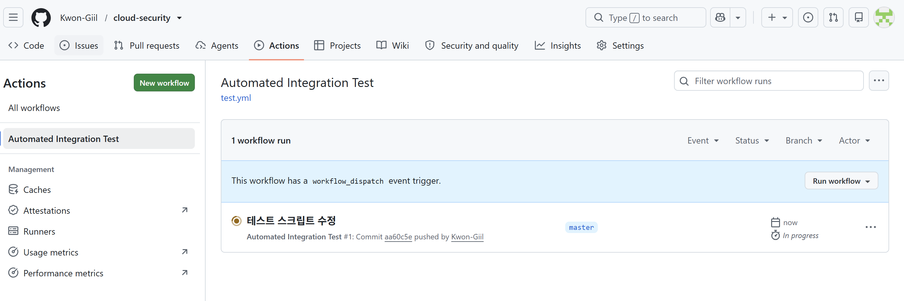
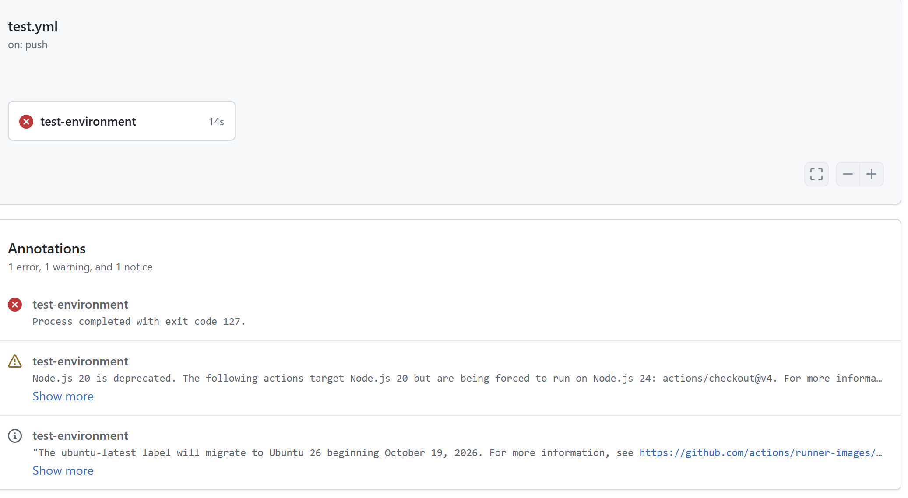
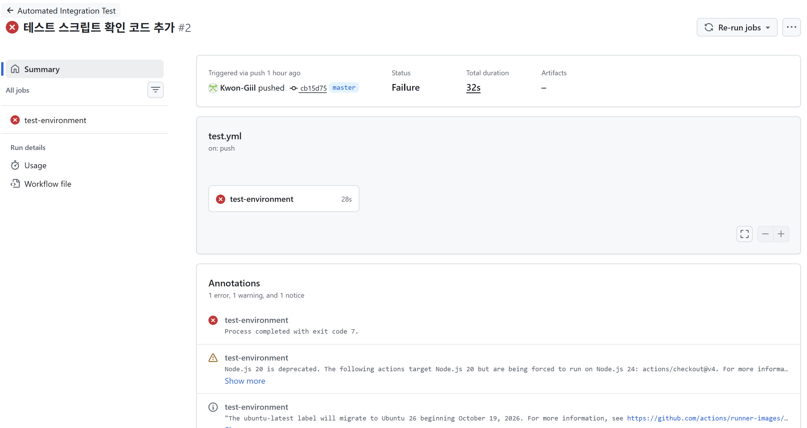
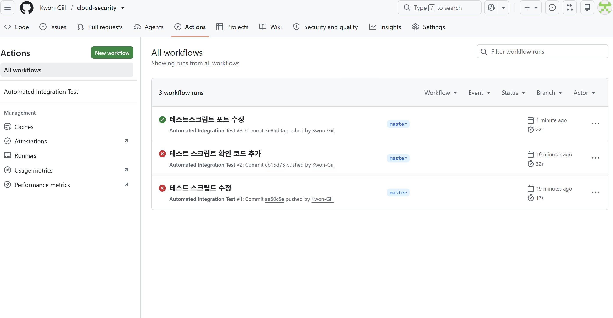
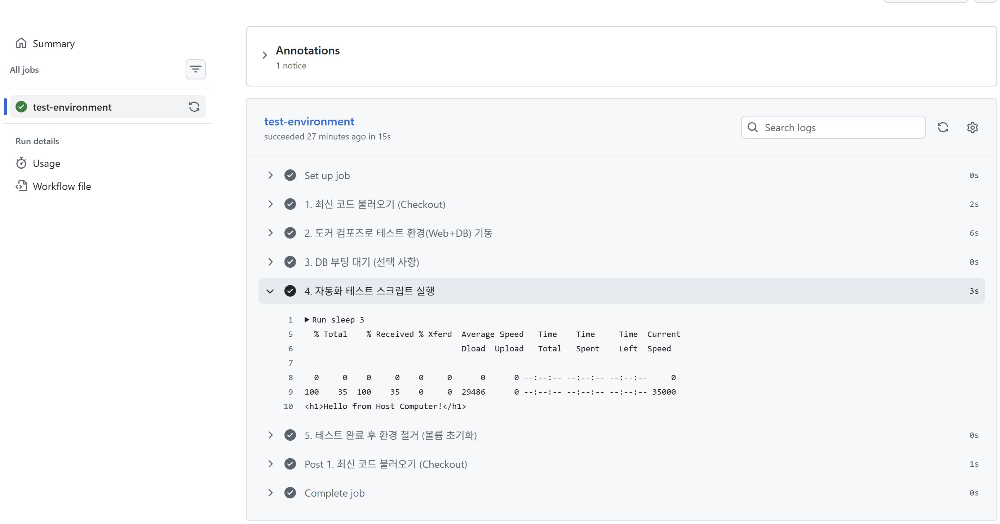

# GitHub Actions CI 기본 실습

**Date:** 2026-09-30  
**Category:** CI/CD / GitHub Actions / Automation

## 1. 학습 목표

GitHub Actions의 기본 구조를 학습하고, Repository에 Push가 발생했을 때 Workflow가 자동으로 실행되도록 구성.

또한 Docker Compose 환경에서 웹 서버의 상태를 자동으로 확인하는 테스트를 GitHub Actions에서 실행하면서 **코드 변경 → 자동 테스트 → 실행 결과 확인**까지의 CI 기본 흐름을 경험

---

## 2. 학습 내용

### 2.1 GitHub Actions

GitHub Actions는 GitHub Repository에서 발생하는 이벤트를 기준으로 작업을 자동으로 실행할 수 있는 기능.

Workflow를 YAML 파일로 정의하고 Trigger, Job, Step 등을 설정하여 특정 이벤트가 발생했을 때 자동으로 작업을 실행할 수 있음.

이번 실습에서는 GitHub Repository에 Push가 발생했을 때 Workflow가 실행되도록 구성.

```text
Git Push
   ↓
GitHub Actions Trigger
   ↓
Workflow 실행
   ↓
Job 실행
   ↓
Step 실행
   ↓
Test 결과 확인
```

---

### 2.2 CI(Continuous Integration)

CI는 코드 변경사항을 Repository에 반영할 때 자동으로 테스트 및 검증 작업을 수행하는 방식.

이번 실습에서는 GitHub Actions를 이용하여 Push 이후 Docker Compose 환경의 웹 서버에 대한 테스트가 자동으로 실행되도록 구성.

주요 흐름은 다음과 같다.

```text
코드 변경
   ↓
Git Push
   ↓
GitHub Actions 실행
   ↓
Docker Compose 환경 실행
   ↓
웹 서버 테스트
   ↓
Pass / Fail 확인
```

---

### 2.3 Workflow 구성

GitHub Actions Workflow는 YAML 파일로 작성.

Workflow의 주요 구성 요소:

| 구성 | 의미 |
|---|---|
| `on` | Workflow를 실행할 Trigger 지정 |
| `jobs` | 실행할 작업 단위 정의 |
| `steps` | Job에서 순서대로 실행할 작업 정의 |

이번 실습에서는 Repository에 Push가 발생하면 Workflow가 실행되도록 구성하고, 테스트 단계를 통해 웹 서버의 정상 동작 여부를 확인함.

---

### 2.4 웹 서버 자동 테스트

초기에는 Docker Compose의 `web` Container 내부에서 `npm test`를 실행하는 방식으로 테스트 시도.

하지만 `web` Container는 Nginx 기반 웹 서버 Container이므로 Node.js와 `npm`이 설치되어 있지 않아 해당 테스트를 실행할 수 없었음.

이후 Container 내부에서 특정 애플리케이션 명령을 실행하는 방식 대신, 외부에서 `curl`을 이용해 웹 서버의 HTTP 응답을 확인하는 방식으로 변경.

```bash
curl -f http://localhost:8080
```

이를 통해 웹 서버가 정상적으로 응답하는지 확인하도록 구성.

---

### 2.5 GitHub Actions 자동 실행 확인

Workflow를 Repository에 반영한 뒤 GitHub에 Push함.

Push 이후 GitHub Actions에서 Workflow가 자동으로 실행되는 것을 확인하고, 테스트 결과가 정상적으로 통과하는 것까지 확인함.

이를 통해 사람이 직접 테스트 명령을 실행하지 않아도 Repository의 변경사항을 기준으로 자동 테스트가 수행되는 기본 CI 흐름을 경험함.



---

## 3. Hands-on

| 실습 | 수행 내용 | 확인 결과 |
|---|---|---|
| **Workflow 작성** | GitHub Actions Workflow YAML 작성 | Workflow 구성 확인 |
| **Push Trigger** | Repository 변경사항 Push | GitHub Actions 자동 실행 확인 |
| **Docker Compose 환경 테스트** | 웹 서버 Container 실행 및 상태 확인 | 테스트 환경 구성 |
| **HTTP 테스트** | `curl -f http://localhost:8080` 실행 | 웹 서버 응답 확인 |
| **자동화 결과 확인** | GitHub Actions 실행 결과 확인 | Test 통과 및 Green 상태 확인 |
| **Action 버전 수정** | `actions/checkout@v4` → `v5` | Node.js 관련 경고 제거 |

---

## 4. Troubleshooting

### 4.1 Container 내부 명령 미존재 (`exit code 127`)

- **상황:** `docker compose exec web npm test` 실행 시 명령어를 찾을 수 없다는 에러 발생.
- **원인:** 웹 서버 Container(`web`) 내부에는 Node.js와 `npm`이 설치되어 있지 않음.
- **해결:** Container 내부에서 `npm test`를 실행하는 방식 대신 외부에서 `curl`을 이용하여 웹 서버의 HTTP 응답을 확인하는 방식으로 테스트 변경.

```bash
curl -f http://localhost:8080
```



---

### 4.2 웹 서버 접속 실패 (`curl: (7) Failed to connect`)

- **상황:** 다음 명령으로 웹 서버에 접속을 시도했으나 연결 실패.



```bash
curl -f http://localhost
```

- **원인:** Docker Compose에서 Host Port와 Container Port를 `8080:80`으로 매핑했기 때문에 Host에서는 `8080` Port를 통해 접근해야 함.
- **해결:** Host Port를 명시하여 테스트.

```bash
curl -f http://localhost:8080
```

수정 후 테스트가 정상적으로 통과하여 GitHub Actions에서 Green 상태 확인.



---

### 4.3 Runner Action 버전 경고 (`Node.js 20 deprecation`)

- **상황:** `actions/checkout@v4` 사용 시 Node.js 버전 관련 권장 안내 경고 출력.
- **해결:** `.github/workflows/test.yml`의 `actions/checkout` 버전을 `v5`로 변경.

```yaml
- uses: actions/checkout@v5
```

Action 버전을 업데이트한 뒤 기존 경고가 제거되는 것을 확인.

---

## 5. Assessment

오늘 GitHub Actions를 이용하여 다음 CI 흐름을 실제로 구성하고 실행.

```text
GitHub Repository
      ↓
Git Push
      ↓
GitHub Actions Trigger
      ↓
Workflow 실행
      ↓
Docker Compose 환경
      ↓
HTTP 테스트
      ↓
Test 결과 확인
```

단순히 Workflow YAML을 작성하는 것에서 끝나지 않고 실제 Push를 통해 Workflow가 자동 실행되고 테스트 결과가 반환되는 것까지 확인.



---

## 6. 오늘 배운 점

오늘은 GitHub Actions를 이용하여 **Repository의 변경사항을 기준으로 자동으로 테스트를 실행하는 기본 CI 흐름**을 직접 경험함.

특히 GitHub Actions가 단순히 명령어를 실행하는 도구가 아니라 Trigger, Job, Step으로 구성된 Workflow를 통해 반복적인 작업을 자동화할 수 있다는 점을 확인함.

또한 Docker Compose 환경에서 테스트를 구성하면서 **테스트 대상 Container에 어떤 도구가 설치되어 있는지 확인하고, 실제 서비스의 상태를 검증할 수 있는 방법을 선택해야 한다는 점**을 경험함.

마지막으로 Action 버전 경고를 확인하고 `actions/checkout@v5`로 업데이트하면서 CI 환경에서 사용하는 Action의 버전도 관리해야 한다는 점 확인.

---

## 7. Key Takeaway

오늘의 핵심은 **GitHub에 코드를 Push하면 사람이 직접 테스트를 실행하지 않아도 GitHub Actions가 정해진 Workflow를 자동으로 실행할 수 있다는 점**임.

```text
Code 변경
   ↓
Git Push
   ↓
GitHub Actions
   ↓
자동 테스트
   ↓
Pass / Fail 확인
```

이번 실습을 통해 CI의 기본적인 개념과 GitHub Actions를 이용한 자동 테스트 실행 흐름을 직접 확인함.

---

## 8. Next

GitHub Actions에서 Docker Image Build를 자동으로 실행하는 방법을 학습하고, 이후 환경변수와 Secrets를 이용하여 설정값과 민감한 정보를 분리하는 방법 학습 예정.

이후 Jenkins를 이용하여 CI/CD 자동화 흐름 구성.