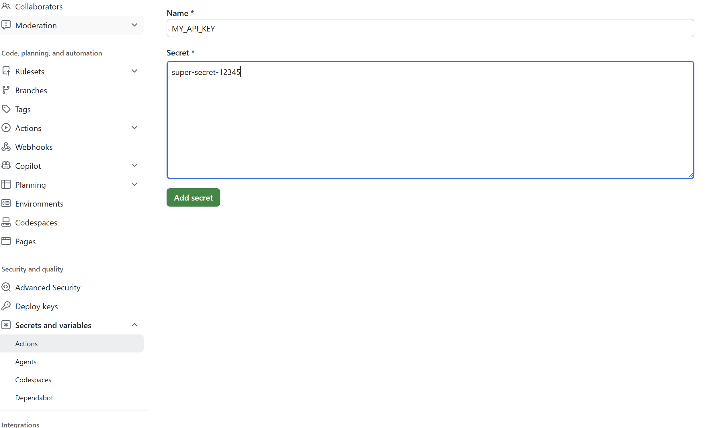
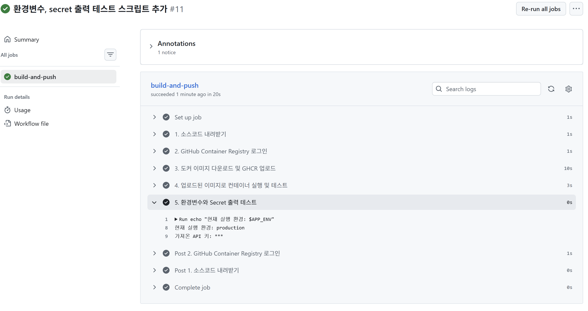
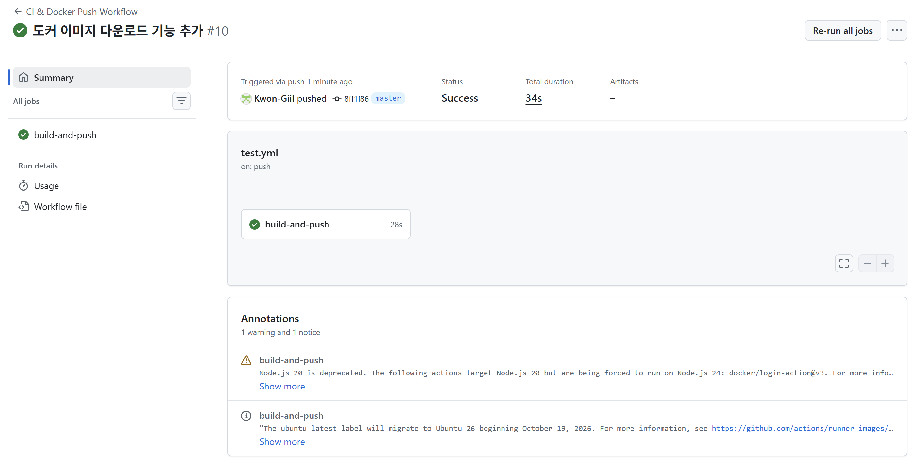

# GitHub Actions — GHCR 연동 및 Secrets 실습

**Date:** 2026-10-01  
**Category:** CI/CD / GitHub Actions / Docker / GitHub Container Registry

## 1. 학습 목표

GitHub Actions를 이용하여 Docker Image를 GitHub Container Registry(GHCR)에 업로드하는 CI/CD 흐름을 구성

또한 GitHub에서 제공하는 `GITHUB_TOKEN`과 `permissions` 설정을 이용하여 별도의 외부 인증키 없이 Registry에 접근하는 방법을 확인

Docker Image를 GHCR에 Push한 뒤 로컬 환경에서 다시 Pull 및 Run하여 업로드된 Image가 정상적으로 동작하는지 검증.

마지막으로 일반 환경설정과 민감한 정보를 구분하여 `env`와 GitHub Secrets를 사용하는 방법을 실습.

---

## 2. 학습 내용

### 2.1 GitHub Container Registry(GHCR)

GHCR(GitHub Container Registry)은 GitHub에서 Docker Container Image를 저장하고 관리할 수 있는 Registry.

이번 실습에서는 GitHub Actions에서 생성하거나 가져온 Docker Image를 GHCR에 Push하는 작업을 구성.

별도의 외부 인증키를 직접 생성하는 대신 GitHub Actions에서 제공하는:

```yaml
secrets.GITHUB_TOKEN
```

을 이용.

또한 Workflow에 Package에 대한 쓰기 권한 설정.

```yaml
permissions:
  packages: write
```

이를 통해 GitHub Actions에서 GHCR에 Image를 Push할 수 있는 환경 구성.

---

### 2.2 GitHub Actions 내장 변수

Workflow에서 다음과 같은 GitHub Actions 내장 변수 사용.

```text
${{ github.actor }}
${{ github.repository }}
```

이를 이용하여 현재 Workflow를 실행하는 사용자와 Repository 정보를 동적으로 가져오도록 구성.

이를 통해 Repository 이름 등을 Workflow에 직접 작성하지 않고 GitHub Actions에서 제공하는 값을 활용하는 방법을 확인.

---

### 2.3 Docker Image Build 및 GHCR Push

기존에는 Dockerfile을 이용하여 직접 Image를 Build하는 방식으로 실습했지만, 이번 프로젝트에는 프로젝트 루트에 단독 `Dockerfile`이 존재하지 않고 `docker-compose.yml`만 작성되어 있었음.

따라서 Workflow에서:

```bash
docker build
```

을 실행했을 때:

```text
open Dockerfile: no such file or directory
```

오류가 발생.

이번 실습에서는 기존 Compose 설정에 정의된 Image를 가져온 뒤:

```bash
docker compose pull
```

Image에 GHCR Registry 주소를 기준으로 Tag를 지정하고 Push하는 방식으로 변경했다.

이를 통해 Dockerfile이 없는 환경에서도 기존 Image를 Registry에 업로드하는 방법을 경험함.

---

### 2.4 GHCR Image 확인

GitHub Repository의 Packages에서 다음 Image가 정상적으로 등록된 것을 확인함.

```text
ghcr.io/kwon-giil/cloud-security:latest
```

이를 통해 GitHub Actions를 이용하여 Docker Image를 GHCR에 Push하는 과정이 정상적으로 수행되었음을 확인함.

---

### 2.5 GHCR Image 로컬 검증

GHCR에 등록된 Image가 실제로 사용할 수 있는지 확인하기 위해 로컬 환경에서 Image를 다시 가져왔음.

```bash
docker pull ghcr.io/kwon-giil/cloud-security:latest
```

이후:

```bash
docker run ...
```

을 실행하여 Container가 정상적으로 구동되는 것을 확인함.

이를 통해:

```text
GitHub Actions
   ↓
GHCR Push
   ↓
GHCR에 Image 저장
   ↓
로컬에서 docker pull
   ↓
docker run
   ↓
Container 실행 확인
```

의 흐름을 경험함.

이번 실습에서는 실제 외부 서버에 배포하는 단계까지 진행한 것이 아니라, **GHCR에 등록한 Image를 로컬에서 다시 받아 실행하는 방식으로 Image 상태를 검증**함.

---

### 2.6 `env`와 `secrets`

Workflow에서 사용하는 값을 일반 환경설정과 민감한 정보로 구분하여 관리하는 방법을 실습함.

| 구분 | 용도 |
|---|---|
| `env` | 외부에 노출되어도 문제가 없는 일반 설정값 |
| `secrets` | 외부에 노출되면 안 되는 민감한 정보 |

예를 들어:

```text
production
```

과 같은 일반 설정값은 환경변수로 사용할 수 있으며,

```text
MY_API_KEY
```

와 같은 민감한 정보는 GitHub Secrets에 저장하여 사용하는 방식.

---

### 2.7 GitHub Secrets 마스킹 확인

GitHub Secrets에 `MY_API_KEY`를 저장하고 Workflow에서 해당 값을 사용.



Workflow 로그에서 Secret 값을 출력했을 때:

```text
***
```

와 같이 실제 값이 마스킹되는 것을 확인.

반면 일반 환경변수로 설정한:

```text
production
```

은 로그에 그대로 표시되는 것을 확인.

이를 통해 일반 설정값과 민감한 정보를 구분하여 관리하고,
GitHub Secrets는 Workflow 로그에서 민감한 정보가 노출되지 않도록 마스킹된다는 것을 확인



---

## 3. Hands-on

| 실습 | 수행 내용 | 확인 결과 |
|---|---|---|
| **GHCR 연동** | `GITHUB_TOKEN` 및 `packages: write` 권한 설정 | GHCR Push 환경 구성 |
| **동적 변수 사용** | `${{ github.actor }}`, `${{ github.repository }}` 사용 | Workflow에서 GitHub 정보 활용 |
| **Docker Image 처리** | `docker compose pull`을 통해 기존 Image 확보 | Dockerfile 없이 Image 사용 |
| **Image Tag 변경** | GHCR 주소를 기준으로 Image Tag 지정 | GHCR Push 준비 |
| **GHCR Push** | Docker Image를 GitHub Packages에 업로드 | Image 정상 등록 확인 |
| **로컬 검증** | `docker pull` 및 `docker run` 실행 | GHCR Image 정상 구동 확인 |
| **환경변수** | 일반 설정값을 `env`로 사용 | 로그에 값이 표시되는 것 확인 |
| **GitHub Secrets** | `MY_API_KEY`를 Secrets에 저장 | 로그에서 Secret이 `***`로 마스킹되는 것 확인 |

---

## 4. Troubleshooting

### 4.1 Dockerfile 미존재 에러

- **상황:** GitHub Actions에서 `docker build` 실행 시 다음 오류 발생.

```text
open Dockerfile: no such file or directory
```

- **원인:** 프로젝트 루트에 단독 `Dockerfile`이 존재하지 않고 `docker-compose.yml`만 작성되어 있었음.
- **해결:** `docker compose pull`을 사용하여 Compose에 정의된 Image를 가져온 뒤, 해당 Image에 GHCR용 Tag를 지정하여 Registry에 Push하는 방식으로 Workflow를 변경.

이를 통해 현재 프로젝트 구조에서 기존 Image를 활용하여 GHCR에 업로드하는 방법 확인.



---

### 4.2 GHCR Image 로컬 검증

GHCR에 Image가 정상적으로 등록되었는지 확인한 뒤 로컬 환경에서:

```bash
docker pull ghcr.io/kwon-giil/cloud-security:latest
```

를 실행하여 Image를 가져왔음.

이후:

```bash
docker run ...
```

으로 Container를 실행하고 정상적으로 구동되는 것을 확인함.

이를 통해 Registry에 Push한 Image를 다시 내려받아 실행하는 과정을 직접 검증했음.


---

## 5. Assessment

오늘 GitHub Actions를 이용하여 다음과 같은 CI/CD 흐름을 구성하고 검증했음.

```text
GitHub Repository
       ↓
GitHub Actions
       ↓
Docker Image 확인
       ↓
GHCR Tag 설정
       ↓
GHCR Push
       ↓
GitHub Packages 등록 확인
       ↓
docker pull
       ↓
docker run
       ↓
Container 실행 확인
```

또한 Workflow에서 사용하는 설정값을 `env`와 `secrets`로 구분하고, GitHub Secrets의 로그 마스킹 동작까지 확인했음.

---

## 6. 오늘 배운 점

오늘은 어제 학습한 GitHub Actions의 기본 자동 실행 흐름에서 한 단계 확장하여 **Docker Image를 GHCR에 업로드하고 다시 가져와 실행하는 CI/CD 흐름**을 경험했음.

특히 별도의 외부 인증키를 직접 생성하지 않고 GitHub Actions의 `GITHUB_TOKEN`과 `packages: write` 권한을 이용하여 GHCR에 접근하는 방식을 확인했음.

또한 프로젝트에 Dockerfile이 존재하지 않는 상황에서 `docker build`가 실패하는 문제를 직접 확인하고, 기존 Compose 설정에서 Image를 가져와 Tag를 변경한 뒤 GHCR에 업로드하는 방식으로 해결했음.

이후 GHCR에 등록된 Image를 로컬에서 다시 `docker pull`하고 `docker run`하여 정상적으로 Container가 실행되는지 검증했음.

마지막으로 `env`와 GitHub Secrets를 구분하여 사용하고, Secrets 값이 Workflow 로그에서 자동으로 마스킹되는 것을 확인하면서 **CI/CD 환경에서 설정값과 민감한 정보를 분리하여 관리하는 기본적인 방법**을 경험했음.

---

## 7. Key Takeaway

오늘의 핵심은 **GitHub Actions가 단순히 테스트를 자동으로 실행하는 것에서 끝나는 것이 아니라 Docker Image를 Registry에 Push하고 이후 다시 사용할 수 있는 흐름으로 확장될 수 있다는 것**임.

```text
Git Push
   ↓
GitHub Actions
   ↓
Docker Image
   ↓
GHCR Push
   ↓
Image 저장
   ↓
docker pull
   ↓
docker run
```

또한 CI/CD에서 사용하는 값은:

```text
일반 설정
→ env

민감한 정보
→ secrets
```

으로 구분하여 관리할 수 있으며, GitHub Secrets는 Workflow 로그에서 값이 자동으로 마스킹되는 것을 확인함.

---

## 8. Next

GitHub Actions에서 환경변수와 Secrets를 활용하는 방법을 추가로 확인하고, Docker Image Build 및 테스트 과정을 자동화하는 Workflow를 구성 예정.

이후 Jenkins를 이용하여 지금까지 학습한 CI/CD 흐름을 다른 자동화 도구로 구성 예정.