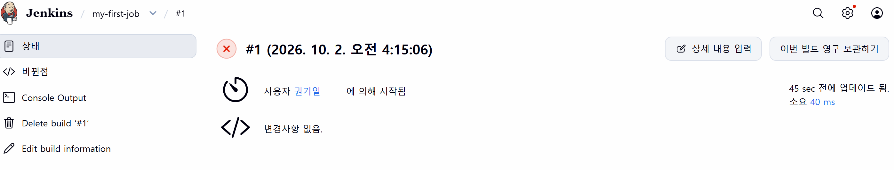

# GitHub Actions Docker Build 및 Jenkins 환경 구축

**Date:** 2026-10-02  
**Category:** CI/CD / GitHub Actions / Docker / Jenkins

## 1. 학습 목표

Dockerfile이 별도로 존재하는 Repository에서 GitHub Actions를 이용하여 Docker Image를 Build하고 GHCR(GitHub Container Registry)에 자동으로 Push하는 CI 흐름을 실습.

또한 GHCR에 업로드된 Image를 로컬 환경에서 Pull하여 Container가 정상적으로 실행되는지 확인.

이후 Jenkins를 Docker Container로 직접 구성하여 Jenkins의 기본 실행 환경을 구축하고, 기존 GitHub Actions에서 학습한 CI/CD 흐름을 Jenkins로 확장하기 위한 기반 마련.

---

## 2. 학습 내용

### 2.1 Dockerfile 기반 GitHub Actions

이전 실습에서는 `docker-compose.yml`에 정의된 기존 Image를 Pull하여 GHCR에 Push하는 방식 사용.

이번에는 별도의 `Dockerfile`이 존재하는 Repository를 구성하여 Docker Image를 직접 Build하는 방식으로 GitHub Actions를 구성.

기본 흐름은 다음과 같음.

```text
Git Push
   ↓
GitHub Actions Trigger
   ↓
Repository Checkout
   ↓
Dockerfile 기반 Image Build
   ↓
GHCR Login
   ↓
Image Tag 설정
   ↓
GHCR Push
```


이를 통해 Docker Compose에서 기존 Image를 사용하는 방식과 Dockerfile을 이용해 직접 Image를 Build하는 방식의 차이 확인

### 2.2 GHCR Image 로컬 검증

GitHub Actions에서 GHCR에 Push한 Image를 로컬 환경에서 다시 Pull해 옴

```bash
docker pull ghcr.io/kwon-giil/qa:latest
```

이후:

```bash
docker run -d -p 8080:80 --name custom-app ghcr.io/kwon-giil/qa:latest
```

를 실행하여 GHCR에 저장된 Image가 로컬 Docker 환경에서도 정상적으로 실행되는 점 확인

이를 통해:

```text
GitHub Actions
      ↓
Docker Image Build
      ↓
GHCR Push
      ↓
docker pull
      ↓
docker run
```
의 흐름 직접 검증

### 2.3 Jenkins

Jenkins는 CI/CD 작업을 자동화하기 위한 서버로, 기존 GitHub Actions에서 수행한 테스트·빌드 등의 작업을 Jenkins Pipeline을 통해 자동화할 수 있음.

이번 실습에서는 Jenkins를 별도의 서버에 설치하는 대신 Docker Container로 실행하여 기본 환경 구성.

Jenkins는 Docker Compose를 이용하여 실행.

```bash
docker compose -f docker-compose0.yml up -d
```

Compose 실행 과정에서 Jenkins Image를 Pull하고 Jenkins 전용 Network와 Volume을 생성한 뒤 my-jenkins Container 실행

Jenkins Log를 통해 Jenkins가 정상적으로 기동되고 Jenkins is fully up and running 상태가 되는 것을 확인

### 2.4 Jenkins 데이터 저장

Jenkins Container의 데이터를 유지하기 위해 Named Volume을 사용

```text
jenkins-server_jenkins_data
```

Volume을 Jenkins의 /var/jenkins_home에 연결하여 Jenkins 설정 및 데이터를 Container와 분리하여 관리하는 구조로 구성

실제 Jenkins 초기 구동 과정에서 해당 경로를 Jenkins Home으로 사용하는 점 확인

---

## 3. Hands-on

| 실습                   | 수행 내용                                         | 확인 결과                      |
| -------------------- | --------------------------------------------- | -------------------------- |
| **Dockerfile 기반 CI** | Dockerfile이 있는 Repository에서 GitHub Actions 구성 | Image Build 및 GHCR Push 수행 |
| **GHCR 검증**          | GHCR Image를 `docker pull`                     | Image 정상 다운로드 확인           |
| **Container 실행**     | `docker run`으로 GHCR Image 실행                  | Container 정상 실행 확인         |
| **Jenkins 구성**       | Jenkins Compose 파일 작성 및 실행                    | Jenkins Container 생성       |
| **Jenkins 초기화**      | Jenkins Log 확인                                | 초기 설정 및 Jenkins 기동 확인      |
| **Jenkins Volume**   | Jenkins Home을 Named Volume으로 구성               | Jenkins 데이터 저장 구조 확인       |

---

## 4. Troubleshooting

### 4.1 GHCR 이미지 이름의 대소문자 문제

GHCR 이미지를 로컬에서 Pull하는 과정에서 저장소 이름을 대문자로 입력하여 다음 오류가 발생함.

```text
invalid reference format: repository name (kwon-giil/QA) must be lowercase
```

Docker 이미지 Repository 이름은 소문자를 사용해야 하므로 `QA`를 `qa`로 수정하여 다시 실행.

```bash
docker pull ghcr.io/kwon-giil/qa:latest
```

이후 이미지가 정상적으로 다운로드되고 컨테이너를 실행할 수 있었음.

### 4.2 Docker Compose 파일 이름과 기존 컨테이너의 포트 충돌

Jenkins 환경을 별도로 구성하기 위해 `jenkins-server` 폴더의 `docker-compose.yml` 파일을 `docker-compose0.yml`로 변경.

이후 기존 `docker-compose.yml`을 사용하는 Compose 환경이 다시 실행되면서 `cloud-security-web-1` 컨테이너가 생성되었고, 해당 컨테이너가 `8080` 포트를 사용하고 있어 Jenkins 환경에서 사용하려던 포트와 충돌.

문제를 확인한 뒤 Jenkins 환경에서는 변경한 Compose 파일을 직접 지정하여 실행.

```bash
docker compose -f docker-compose0.yml up -d
```

이를 통해 의도한 Jenkins Compose 설정으로 컨테이너를 실행할 수 있었음.

### 4.3 Jenkins Docker Socket 연동 설정 후 발생한 Jenkins 실행 오류

Jenkins 자체의 기본적인 빌드 동작을 확인한 후, Jenkins에서 Docker를 사용할 수 있도록 `docker-compose0.yml`에 Docker Socket 연동 설정 추가.

설정을 변경한 뒤 Jenkins를 다시 실행하고 로컬에서 페이지를 확인했으나 Jenkins 페이지가 정상적으로 표시되지 않았음.



원인을 확인하기 위해 다음 명령으로 Jenkins 컨테이너 로그를확인.

```bash
docker logs my-jenkins
```

로그에서 다음 오류 확인.

```text
touch: cannot touch '/var/jenkins_home/copy_reference_file.log': Permission denied
Can not write to /var/jenkins_home/copy_reference_file.log. Wrong volume permissions?
```

확인 결과 Jenkins가 `/var/jenkins_home` 경로에 필요한 파일을 생성하지 못하는 **Volume 권한 문제**가 발생.

문제를 해결하기 위해 기존 Jenkins 컨테이너와 Named Volume을 함께 제거한 뒤 Jenkins 환경을 다시 생성.

```bash
docker compose -f docker-compose0.yml down -v
docker compose -f docker-compose0.yml up -d
```

재생성 후 Jenkins 로그를 다시 확인했고, 정상적으로 Jenkins가 실행되며 `Jenkins is fully up and running` 메시지가 출력되는 것을 확인함.

이번 문제를 통해 **Jenkins 설정을 변경한 뒤 정상적으로 동작하지 않을 경우, 컨테이너 로그를 통해 실제 오류 원인을 확인하고 필요한 경우 컨테이너와 Volume을 재생성하여 환경을 초기화할 수 있다는 점**을 경험함.

---

### 4.4 Docker Compose `version` 속성 경고

`docker-compose0.yml`을 실행할 때 다음과 같은 경고가 반복해서 표시됨.

```text
the attribute `version` is obsolete, it will be ignored
```

Compose는 해당 `version` 값을 무시하고 실행했으며, 이번 실습에서는 기능상 오류로 이어지지 않았음.

추후 Compose 파일을 정리할 때 불필요한 `version` 속성을 제거할 수 있음을 확인함.

---

## 5. Assessment

오늘은 Dockerfile이 별도로 존재하는 Repository에서 GitHub Actions를 통해 Docker Image를 Build하고 GHCR에 Push하는 흐름을 다시 구성.

이후 GHCR에 업로드된 Image를 로컬에서 Pull하고 Container로 실행하여 Image가 정상적으로 동작하는 것까지 확인.

또한 Jenkins를 Docker Container로 구성하고 초기 설정 및 실행 상태 확인.

전체 흐름:

```text
Dockerfile
   ↓
GitHub Actions
   ↓
Docker Image Build
   ↓
GHCR Push
   ↓
docker pull
   ↓
docker run
   ↓
Jenkins 환경 구축
```

---

## 6. 오늘 배운 점

오늘은 이전에 Docker Compose에 정의된 Image를 사용하는 방식과 달리 Dockerfile을 기준으로 직접 Image를 Build하여 GHCR에 Push하는 CI 흐름을 경험함.

이를 통해 프로젝트 구조에 따라 GitHub Actions의 Image 처리 방식이 달라질 수 있음을 확인함.

또한 GHCR에 업로드한 Image를 다시 로컬 환경에서 Pull하여 Container로 실행하면서 Registry에 저장된 Image를 실제로 사용하는 과정을 확인함.

이후 Jenkins를 Docker Container로 구성하면서 CI/CD 도구 자체도 Container 환경에서 실행할 수 있다는 것을 확인함.

Jenkins 환경을 구성하는 과정에서는 Port 충돌, Container 이름 확인, Volume 권한 등 기존 Docker 학습에서 접했던 문제를 다시 경험했으며, Jenkins 자체의 정상적인 기동까지 확인

---

## 7. Key Takeaway

오늘은 다음 두 가지 흐름을 연결

```text
[GitHub Actions]

Git Push
   ↓
Dockerfile
   ↓
Image Build
   ↓
GHCR Push
   ↓
docker pull
   ↓
docker run
```
그리고:

```text
[Jenkins]

Docker Compose
   ↓
Jenkins Container
   ↓
Jenkins Home Volume
   ↓
Jenkins 초기 설정
   ↓
Jenkins 정상 기동
```

특히 Dockerfile이 있는 프로젝트에서는 기존 Compose Image를 단순히 Pull하여 사용하는 것이 아니라 Dockerfile을 기반으로 새로운 Image를 Build한 뒤 Registry에 Push할 수 있다는 차이 확인.

Jenkins는 오늘 기본 환경 구축까지 완료했으며, 다음 단계에서는 Jenkins Pipeline을 직접 실행하여 GitHub Actions에서 학습한 CI 흐름과 비교.

---

## 8. Next

Jenkins Pipeline의 기본 구조를 학습하고, 간단한 Test → Docker Build → GHCR Push 과정을 Jenkins에서 실행하여 GitHub Actions와 Jenkins의 CI 방식 차이 확인 예정


