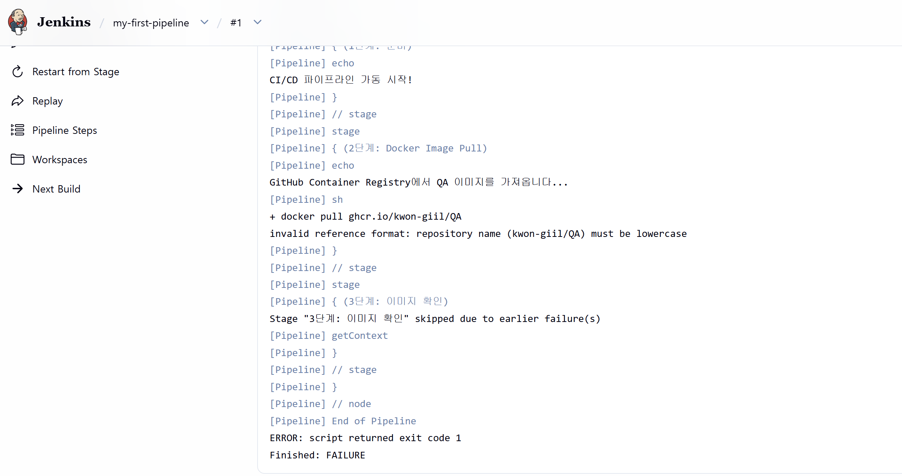

# Jenkins Pipeline 및 GHCR 연동

**Date:** 2026-10-03
**Category:** CI/CD / Jenkins / GitHub / Docker / GHCR

## 1. 학습 목표

Jenkins Pipeline을 직접 작성하고 실행하면서 Jenkins에서 CI 작업을 구성하는 기본 흐름 학습.

또한 GitHub 보안 토큰을 생성하여 Jenkins에서 GitHub 인증에 사용하는 방법을 확인하고, 기존 Docker Image를 Jenkins에서 가져와 GHCR과 연결하는 과정까지 실습.

최종적으로 Jenkins에서 Docker 관련 작업과 GitHub 인증 정보를 연결하여 기존에 학습한 Docker 및 GHCR 작업을 Pipeline으로 자동 실행하는 흐름을 경험.

---

## 2. 학습 내용

### 2.1 Jenkins Pipeline

Jenkins에서 Pipeline을 이용하여 여러 작업을 단계별로 실행할 수 있음을 확인.

오늘은 Jenkins에 새로운 프로젝트를 생성하고 Pipeline Script를 직접 작성 및 수정하면서 Jenkins에서 Docker 관련 작업을 자동으로 실행하는 기본적인 방법 학습.

기존에 GitHub Actions에서 경험했던 CI 작업과 비교하면서 Jenkins에서도 비슷한 작업 흐름을 구성할 수 있음을 확인.

### 2.2 GitHub 보안 토큰

Jenkins에서 GitHub와 연동하기 위해 GitHub 보안 토큰 생성.

생성한 토큰을 Jenkins에서 사용할 인증 정보로 연결하여 Pipeline에서 GitHub 관련 작업을 수행할 수 있도록 구성.

이를 통해 CI 환경에서 외부 서비스에 접근할 때 인증 정보를 별도로 관리하는 기본적인 방식을 확인.

### 2.3 Docker Image Pull

새롭게 생성한 Jenkins 프로젝트에서 기존에 사용하던 Docker Image를 Pull하는 작업을 Pipeline에서 실행.

처음에는 Pipeline 실행 과정에서:

```text
script returned exit code 127
```

오류가 발생.



Jenkins 컨테이너 내부에 Docker Client를 다시 설치하고 Docker 명령 실행에 필요한 권한 설정

이후 기존에 사용하던 Docker Image를 Jenkins에서 정상적으로 Pull할 수 있는 환경 구성.

### 2.4 GHCR 연동

기존에 GitHub Actions에서 실습했던 GHCR 연동 작업을 Jenkins에서도 연결.

GitHub 보안 토큰을 Jenkins의 인증 정보로 사용하고, Pipeline에서 기존 Docker Image를 가져와 GHCR과 연결하는 작업 구성.

전체적인 흐름은 다음과 같음.

```text
Jenkins Pipeline
      ↓
GitHub 인증
      ↓
Docker Client
      ↓
기존 Docker Image Pull
      ↓
GHCR 연동
```

---

## 3. Hands-on

| 학습 항목                 | 실제 수행 내용                                       | 확인 결과                               |
| --------------------- | ---------------------------------------------- | ----------------------------------- |
| **Jenkins Pipeline**  | 새로운 Jenkins 프로젝트를 생성하고 Pipeline Script 작성 및 수정 | Jenkins에서 Pipeline 작업 실행 확인         |
| **GitHub 보안 토큰**      | GitHub에서 보안 토큰 생성                              | Jenkins에서 사용할 인증 정보 준비              |
| **Docker Client 구성**  | Jenkins 환경에서 Docker Client를 다시 구성하고 필요한 권한 설정  | Jenkins에서 Docker 명령을 실행할 수 있는 환경 구성 |
| **Docker Image Pull** | 기존 Docker Image를 Jenkins Pipeline에서 Pull하도록 구성 | Jenkins에서 기존 Image를 가져오는 작업 확인      |
| **GHCR 연동**           | GitHub 인증 정보를 이용하여 GHCR 관련 작업 연결               | Jenkins와 GHCR을 연결하는 기본 구조 확인        |

---

## 4. Troubleshooting

### 4.1 Jenkins Pipeline에서 Docker 명령 실행 실패

새롭게 생성한 Jenkins 프로젝트에서 기존 Docker Image를 Pull하도록 Pipeline을 실행했으나 다음 오류가 발생.

```text
script returned exit code 127
```

문제를 해결하는 과정에서 기존 Jenkins 컨테이너를 정리하고 Jenkins 환경에서 Docker Client를 다시 설치.

Docker Client를 다시 구성하는 과정에서 권한 문제도 발생하여 Docker 관련 권한을 다시 설정.

이후 Jenkins에서 Docker 명령을 정상적으로 실행할 수 있는 환경을 구성했고, 기존 Docker Image를 Pipeline에서 Pull할 수 있도록 수정.

최종적으로 Docker 명령을 직접 실행하는 것이 아니라 **Jenkins Pipeline Script에 Docker Image Pull 작업을 포함하여 Pipeline 실행 시 자동으로 수행하도록 구성**.

```text
Jenkins Pipeline 실행
        ↓
Docker 명령 실행
        ↓
기존 Docker Image Pull
        ↓
다음 Pipeline 작업 실행
```

이를 통해 Jenkins Pipeline에서 Docker 작업을 자동으로 실행할 수 있는 기본적인 환경 구성.

---

## 5. Assessment

다음 요소를 하나의 Jenkins 작업 흐름으로 연결할 수 있는지 확인함.

```text
Jenkins Pipeline
        ↓
GitHub 인증
        ↓
Docker Client
        ↓
기존 Docker Image Pull
        ↓
GHCR 연동
```

Jenkins Pipeline을 직접 구성하고 GitHub 보안 토큰과 Docker 환경을 연결하여 기존 Docker Image를 Pipeline에서 자동으로 가져오는 작업 확인.

또한 기존에 학습한 GHCR 연동 구조를 Jenkins 환경에서도 연결하여 CI 도구가 달라져도 Docker와 Registry를 연계할 수 있음을 확인.

---

## 6. 오늘 배운 점

오늘은 Jenkins를 단순히 설치하고 실행하는 것에서 나아가 **Jenkins Pipeline에 실제 Docker 작업을 연결하는 방법**을 경험함.

또한 GitHub 보안 토큰을 생성하고 Jenkins에서 인증 정보로 연결하면서 CI 환경에서 외부 서비스의 인증 정보를 관리하는 기본적인 방법 확인.

특히 기존에 만들어 둔 Docker Image를 Jenkins에서 직접 Pull하고, 이 작업을 Pipeline Script에 포함하여 자동으로 실행하도록 구성하면서 **기존 Docker 작업을 CI Pipeline으로 연결하는 방법** 경험.

앞서 GitHub Actions에서 경험했던 GHCR 연동을 Jenkins에서도 연결하면서, 서로 다른 CI 도구를 사용하더라도 **Docker Image와 Container Registry를 중심으로 비슷한 작업 흐름을 구성할 수 있다는 점** 확인.

---

## 7. Key Takeaway

오늘은 다음 흐름을 직접 연결.

```text
Jenkins
  ↓
Pipeline
  ↓
GitHub 인증
  ↓
Docker Client
  ↓
기존 Docker Image Pull
  ↓
GHCR 연동
```

특히 새로운 Docker Image를 만드는 것보다 **기존에 학습한 Docker Image와 GHCR 작업을 Jenkins Pipeline에서 다시 활용하고 자동 실행하도록 구성했다는 점**에 의미가 있었음.

앞서 학습한 GitHub Actions와 이번 Jenkins 실습을 통해 **CI 도구가 달라져도 기존 Docker 작업과 Registry 작업을 Pipeline으로 연결할 수 있다는 기본적인 구조**를 경험했음.

---

## 8. Next

지금까지 학습한 Linux, Docker, GitHub Actions, GHCR, Jenkins의 연결 구조를 정리하고, 이후 Cloud 환경에서 이러한 CI/CD 기술이 AWS와 어떻게 연결되는지 학습 예정.
