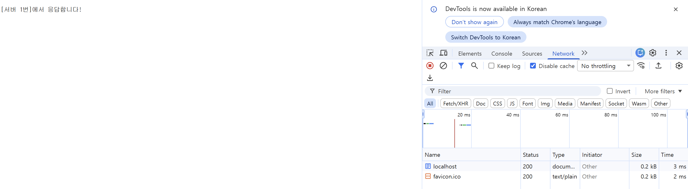

# Cloud Load Balancing 및 Health Check 모사 실습

**Date:** 2026-10-06
**Category:** Cloud / Network / Load Balancing / Docker

## 1. 학습 목표

Docker 기반 로컬 환경에서 **Load Balancing과 Health Check의 기본 구조**를 구성하고 실제 요청 결과를 통해 동작 확인.

기존 단일 Application 구조를 두 개의 Application Instance로 변경하고, Nginx Proxy를 통해 요청을 전달하면서 Application 상태 변경에 따른 동작 확인.

---

## 2. 학습 내용

### 2.1 Load Balancing

여러 Application Instance를 하나의 Backend Group으로 구성하고 요청을 분산하는 구조 학습.

이번 실습에서는 Nginx의 `upstream`을 이용하여 `app1`, `app2`를 하나의 Backend Group으로 구성.

```conf
upstream backend_servers {
    server app1:5678 max_fails=2 fail_timeout=10s;
    server app2:5678 max_fails=2 fail_timeout=10s;
}
```

Proxy에서 전달되는 요청은 다음 Backend Group을 통해 처리하도록 구성.

```conf
location / {
    proxy_pass http://backend_servers;
}
```

### 2.2 Health Check

이번 실습에서는 Nginx의 `max_fails`와 `fail_timeout`을 이용하여 **실제 요청 처리 과정에서 발생한 실패를 기준으로 Backend 상태를 판단할 수 있도록 구성

```conf
server app1:5678 max_fails=2 fail_timeout=10s;
server app2:5678 max_fails=2 fail_timeout=10s;
```

하나의 Backend에 요청 실패가 발생하면 Nginx가 해당 Backend를 비정상 대상으로 판단할 수 있도록 설정.

---

## 3. Hands-on

### 3.1 로컬 환경 구성

Load Balancing과 Health Check을 확인하기 위해 기존 환경을 `app1`, `app2`, `proxy` 구조로 구성.

```text
Client
   ↓
Nginx Proxy
   ↓
Private Network
 ├─ app1
 └─ app2
```

`app1`과 `app2`는 서로 다른 응답을 반환하도록 구성.

```yaml
app1:
  image: hashicorp/http-echo
  command: -text="[서버 1번]에서 응답합니다!"

app2:
  image: hashicorp/http-echo
  command: -text="[서버 2번]에서 응답합니다!"
```

Proxy는 `public_net`과 `private_net`에 연결하고, 두 Application은 `private_net`에 연결.

### 3.2 Nginx Backend Group 구성

Nginx에 `upstream backend_servers`를 구성하고 `app1`, `app2`를 Backend로 등록.

```conf
upstream backend_servers {
    server app1:5678 max_fails=2 fail_timeout=10s;
    server app2:5678 max_fails=2 fail_timeout=10s;
}
```

Proxy 요청은 다음과 같이 Backend Group으로 전달하도록 설정.

```conf
location / {
    proxy_pass http://backend_servers;
}
```

### 3.3 서비스 실행 및 상태 확인

Docker Compose를 실행한 뒤 다음 명령으로 Container 상태 확인.

```bash
docker compose ps
```

최종적으로 `app1`, `app2`, `proxy` Container가 실행 중인 상태 확인.

```text
docker-vpc-lab-app1-1    Up
docker-vpc-lab-app2-1    Up
docker-vpc-lab-proxy-1   Up
```

Proxy는 Host의 `8080` 포트를 통해 접근하도록 구성.

### 3.4 Load Balancing 실제 검증

다음과 같이 Proxy에 연속으로 요청을 전달.

```bash
curl http://localhost:8080
curl http://localhost:8080
```

실제 응답은 다음과 같았다.

```text
[서버 1번]에서 응답합니다!
[서버 2번]에서 응답합니다!
```

이를 통해 하나의 Proxy 주소로 요청했지만 Backend인 `app1`, `app2`가 번갈아 응답하는 것을 확인.

즉:

```text
Client
  ↓
localhost:8080
  ↓
Nginx Proxy
  ↓
app1 → app2 → app1 → app2
```

형태로 요청이 분산되는 것을 실제 응답으로 검증.

### 3.5 Application 상태 변경

Load Balancing 대상 중 하나의 상태를 변경하기 위해 `app1`을 중지.

```bash
docker-compose stop app1
```

이후 다시 실행.

```bash
docker-compose start app1
```

이를 통해 특정 Application Instance를 개별적으로 중지하고 다시 시작하는 작업을 직접 수행.

이번 로그에서는 `app1`이 중지된 상태에서 요청을 다시 보내 Nginx가 해당 Backend를 제외하는 결과까지는 확인하지 않았으며, **Application 상태 변경 자체까지만 검증.**

---

## 4. Troubleshooting

### 4.1 Nginx가 Backend를 찾지 못하는 문제

초기 `docker compose up -d` 실행 후 Proxy 로그를 확인하는 과정에서 다음 오류 발생.

```text
host not found in upstream "app1:5678"
```

Nginx가 `app1:5678`을 Backend로 확인하지 못하면서 Proxy가 정상적으로 실행되지 않는 상태 확인.

해결 과정에서 `docker-compose.yml`의 `proxy` Service에 `depends_on`을 추가하여 `app1`, `app2`에 대한 의존 관계 명시.

```yaml
proxy:
  depends_on:
    - app1
    - app2
```

이후 Compose 환경을 다시 구성.

```bash
docker compose down
docker compose up -d
```

### 4.2 Proxy 접근 시 Connection Refused

`depends_on`을 추가한 뒤 다시 구성하는 과정에서 `localhost:8080`으로 접근했지만 다음과 같이 연결되지 않았음.

```bash
curl -v http://localhost:8080
```

```text
connect to 127.0.0.1 port 8080 failed: Connection refused
curl: (7) Failed to connect to localhost port 8080
```

`localhost:80`으로 접근했을 때도 동일하게 연결되지 않았음.

확인 과정에서 기존 Network 구성이 내부 Network만 사용하도록 되어 있어 Host의 `localhost`에서 Proxy로 접근할 수 없는 상태임을 확인.

이에 `docker-compose.yml`의 Network 구성을 다음과 같이 변경.

```yaml
proxy:
  networks:
    - public_net
    - private_net

app1:
  networks:
    - private_net

app2:
  networks:
    - private_net

networks:
  public_net:

  private_net:
    internal: true
```

즉, Proxy는 외부 요청을 받기 위해 `public_net`에 연결하고, Application은 `private_net`에만 연결하도록 분리.

`private_net`은 `internal: true`로 설정하여 내부 Application Network로 구성.

이후 Compose 환경을 다시 생성.

```bash
docker compose down
docker compose up -d
```

재구성 후:

```bash
curl http://localhost:8080
```

요청이 정상적으로 처리되었고, 다음과 같이 Application의 응답을 확인.

```text
[서버 1번]에서 응답합니다!
```



---

## 5. Assessment

오늘은 다음 구조를 실제 Docker 환경에서 구성.

```text
Client
  ↓
Nginx Proxy
  ↓
Backend Group
 ├─ app1
 └─ app2
```

`curl http://localhost:8080`을 반복 실행하여 실제 응답이:

```text
[서버 1번]에서 응답합니다!
[서버 2번]에서 응답합니다!
```

순서로 나타나는 것을 확인하면서 Load Balancing 동작을 검증.

또한 `app1`을 직접 중지하고 다시 시작하여 Application Instance의 상태를 변경하는 작업까지 수행.

Nginx에는 `max_fails`와 `fail_timeout`을 설정하여 Passive Health Check 구조를 구성했지만, **app1 중지 상태에서 실제 요청을 보내 Backend 자동 제외 여부까지는 이번 실습에서 확인하지 않았음.**

---

## 6. 오늘 배운 점

오늘은 기존 Docker 기반 네트워크 환경을 여러 Application Instance를 사용하는 구조로 변경하고, Nginx의 `upstream`을 이용하여 **Load Balancing을 실제 요청 결과로 확인**.

특히 서로 다른 응답을 반환하는 `app1`, `app2`를 구성한 뒤 동일한 `localhost:8080` 주소로 요청했을 때 서버 1번과 서버 2번의 응답이 번갈아 나타나는 것을 확인.

또한 Nginx에 `max_fails`와 `fail_timeout`을 적용하여 Passive Health Check 구조를 구성하고, `app1`을 직접 중지·재시작하면서 Backend의 상태를 변경하는 과정도 경험함.

---

## 7. Key Takeaway

오늘은 다음 흐름을 직접 구성하고 검증.

```text
Client
  ↓
Nginx Proxy
  ↓
upstream backend_servers
  ├─ app1
  └─ app2
       ↓
요청 분산
       ↓
서버 1번 / 서버 2번 응답 확인
```

기존의 단일 Application 구조를 다중 Application 구조로 확장하면서 **Load Balancing이 실제 요청 분산으로 어떻게 나타나는지 직접 확인**.

또한 Network 구성을 Public / Private로 분리하여 Proxy는 외부 요청을 받고 Application은 Private Network에 배치하는 구조 구성.

Health Check을 위한 Nginx 설정과 Application 중지·재시작을 수행했지만, **실제 장애 발생 후 Backend가 자동으로 제외되는 결과까지 검증한 것은 아니므로 해당 부분은 다음 단계에서 추가 확인할 수 있는 상태**로 남겼음.

이번 실습 역시 실제 AWS나 GCP의 Load Balancer를 사용한 것이 아니라 **Docker Compose와 Nginx를 이용한 Cloud Load Balancing 및 Health Check 구조의 로컬 모사**라는 점 구분.

---

## 8. Next

Cloud Provider가 결정되면 오늘 로컬에서 확인한 Load Balancing 구조를 실제 Cloud의 Load Balancer와 Compute 환경에 연결하여 확인.

이후 Terraform을 이용하여 VPC, Subnet, Network, Compute 등의 Cloud Infrastructure를 코드로 생성하고 관리하는 단계로 확장.
