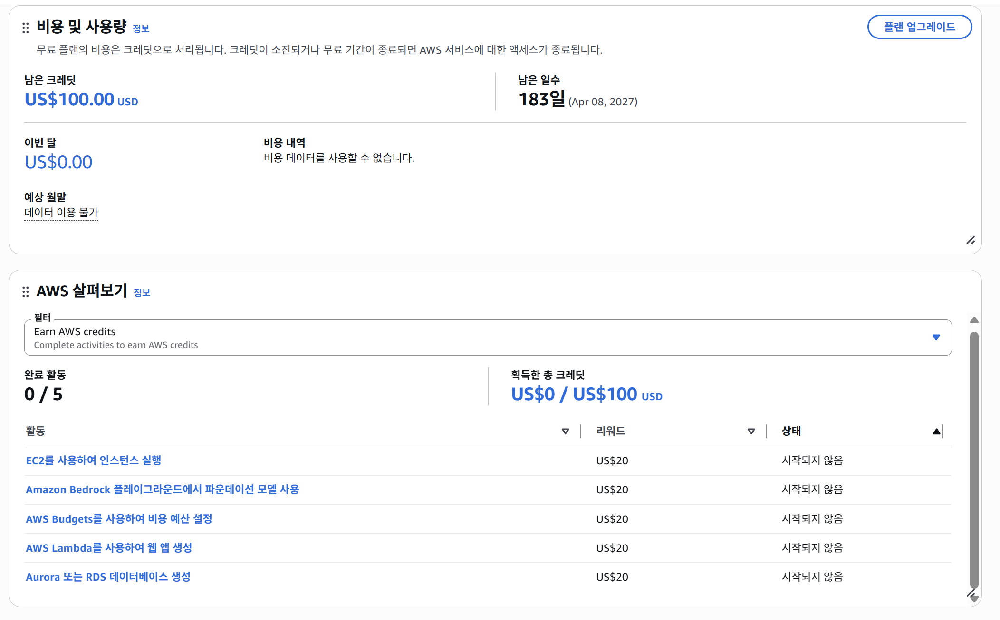
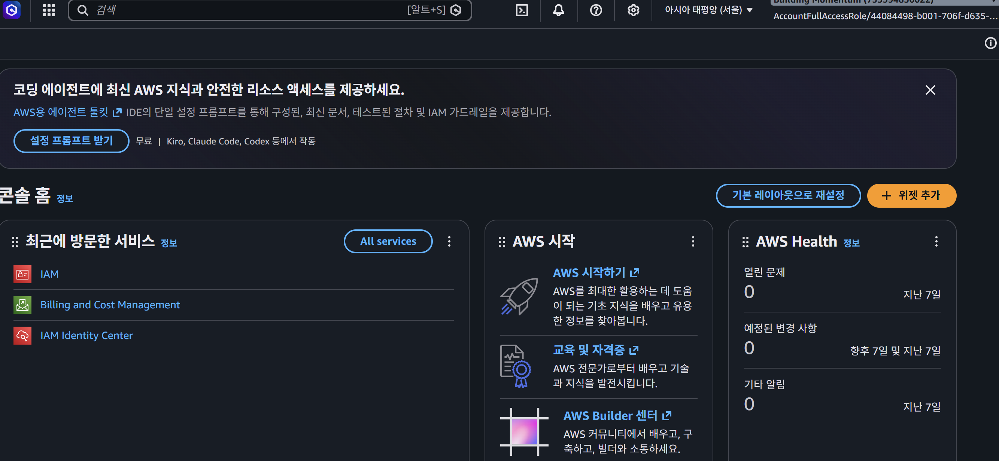
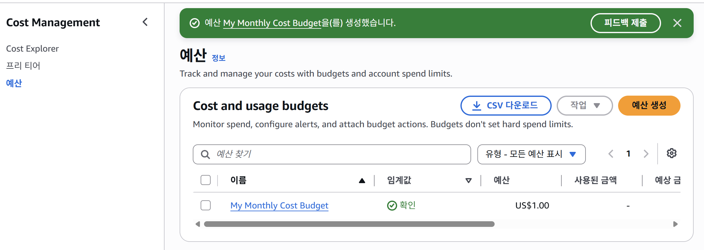
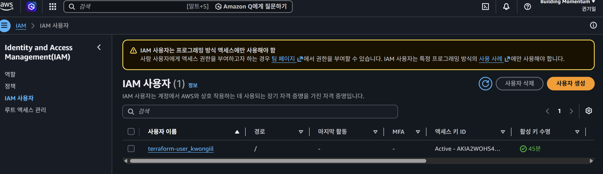
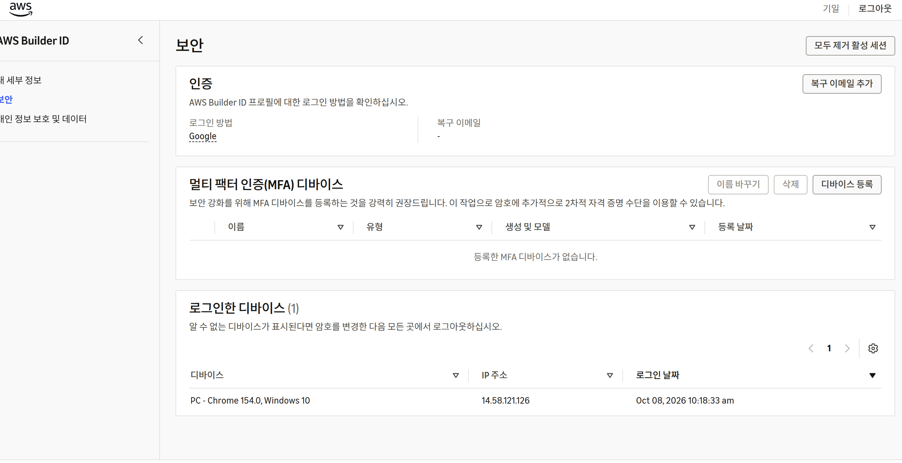
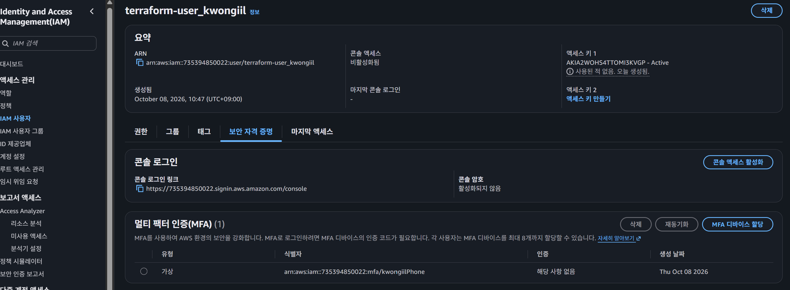

# AWS 계정 및 비용·보안 초기 설정

**Date:** 2026-10-08
**Category:** Cloud / AWS / Security / Cost Management

## 1. 학습 목표

AWS Cloud 실습을 시작하기 전에 계정을 생성하고, 실제 AWS Resource를 사용하기 전에 **비용과 접근 권한을 통제할 수 있는 기본 환경을 구성**.

또한 AWS의 Free Plan과 크레딧 상태를 확인하고, IAM 사용자와 MFA를 설정하여 이후 Cloud 실습을 안전하게 진행할 수 있는 기본 환경을 준비한다.

---

## 2. 학습 내용

### 2.1 AWS 계정 및 Free Plan 확인

AWS 계정을 생성하고 현재 플랜과 크레딧 상태 확인.



실제 AWS Resource를 생성하기 전에는 현재 비용이 발생하지 않고 있음을 확인.

### 2.2 AWS Region 설정

계정 생성 후 기본 Region이 Sydney로 설정되어 있는 것 확인.

Cloud 실습을 한국 환경을 기준으로 진행하기 위해 기본 Region을 **Asia Pacific (Seoul)**&#xB85C; 변경.



### 2.3 비용 관리 설정

AWS 실습을 시작하기 전에 월 예산을 `$1`로 설정하고 개인 이메일을 알림 수신자로 지정.



Budget이 정상적으로 생성 확인.

또한 Cost Explorer와 Cost Anomaly Detection의 현재 상태를 확인했다. 신규 계정 상태에서는 추가로 조정할 항목이 없음을 확인.

### 2.4 IAM 사용자 및 MFA 설정

일상적인 AWS 작업에 사용할 IAM 사용자 생성.



또한 AWS Builder ID와 IAM 사용자의 MFA가 서로 별도의 인증 설정을 사용하는 것을 확인하고 각각 MFA를 설정.





이를 통해 AWS 로그인에 사용하는 인증 주체에 따라 MFA도 별도로 관리해야 한다는 점 확인.

---

## 3. Hands-on

| 학습 항목          | 실제 수행 내용                       | 확인 결과                          |
| -------------- | ------------------------------ | ------------------------------ |
| **AWS 계정 생성**  | AWS 계정 생성 및 플랜 확인              | Free Plan / $100 크레딧 확인        |
| **Region 설정**  | 기본 Region을 Sydney에서 Seoul로 변경  | Asia Pacific (Seoul) 설정        |
| **Budget 설정**  | 월 예산 $1 및 이메일 알림 설정            | `My Monthly Cost Budget` 생성 확인 |
| **IAM 사용자 생성** | `terraform-user_kwongiil` 생성   | IAM 사용자 생성 확인                  |
| **MFA 설정**     | Builder ID와 IAM 사용자에 각각 MFA 설정 | 두 인증 주체에 MFA 등록 확인             |

이번 단계에서는 실제 EC2, EBS, S3 등의 Resource를 생성하지 않고 **계정, 비용, 접근 통제 환경을 먼저 구성**.

---

## 4. Troubleshooting

### 4.1 기본 Region이 Sydney로 설정된 문제

AWS 계정 생성 후 기본 Region이 Sydney로 설정되어 있는 것을 확인.

Cloud 실습을 한국 환경에서 진행하기 위해 기본 Region을 Seoul로 변경.

```text
Asia Pacific (Sydney)
        ↓
Asia Pacific (Seoul)
```

### 4.2 MFA 설정 메뉴 위치 확인 과정에서 혼선

MFA를 설정하는 과정에서 처음에는 AWS 콘솔의 어느 메뉴에서 설정해야 하는지 바로 찾지 못해 여러 메뉴 확인.

먼저 AWS Builder ID의 MFA 설정 위치를 찾는 과정에서 AWS 콘솔이 아닌 Builder ID 프로필 영역에서 MFA를 설정한다는 것을 확인.

이후 IAM 사용자에도 별도로 MFA를 설정해야 했지만, IAM 사용자 설정 메뉴에서 MFA 항목을 바로 찾지 못해 다시 메뉴 확인.

최종적으로 다음 경로에서 IAM 사용자의 MFA 설정 위치를 확인

```text
IAM
  ↓
Users
  ↓
terraform-user_kwongiil
  ↓
Security credentials
  ↓
Multi-factor authentication
  ↓
Assign MFA device
```

이를 통해 AWS Builder ID의 MFA와 IAM User의 MFA는 동일한 설정이 아니며, 각각 별도의 위치에서 설정해야 한다는 점 확인.

또한 MFA 설정 과정에서는 기능 자체보다 어떤 계정 유형의 MFA를 설정하는지 먼저 구분하는 것이 중요하다는 점을 경험

---

## 5. Assessment

AWS Resource를 생성하기 전에 계정의 플랜과 비용 상태를 확인하고, Region, Budget, IAM 사용자, MFA 설정을 직접 구성.

실제 Resource 생성 없이 이후 Cloud 실습에 필요한 기본 환경을 준비한 것을 확인.

---

## 6. 오늘 배운 점

오늘은 Cloud Infrastructure를 구축하기 전에 **AWS 계정의 비용 관리와 접근 보안을 먼저 설정하는 과정**을 경험했다.

특히 계정 생성 후 바로 Resource를 실행하지 않고 비용과 권한을 먼저 통제하면서 **안전한 Cloud 실습 환경을 먼저 구성하는 것이 중요하다는 점** 확인.

---

## 7. Key Takeaway

오늘은 다음 순서로 AWS 실습 환경 준비.

```text
AWS 계정 생성
  ↓
Free Plan / 크레딧 확인
  ↓
Seoul Region 설정
  ↓
Budget $1 설정
  ↓
IAM User 생성
  ↓
MFA 설정
  ↓
실제 Cloud Resource 생성은 이후 진행
```

**Cloud Resource를 생성하기 전에 계정의 비용과 접근 통제를 먼저 구성하고, 이후 필요한 Infrastructure를 단계적으로 생성하는 흐름**을 경험.

---

## 8. Next

Terraform을 설치하고 AWS Provider를 연결하여 AWS Infrastructure를 코드로 관리하기 위한 기본 환경 구성 예정.

실제 AWS Resource 생성은 Terraform 설정과 비용 검토 완료 이후 진행 예정.
