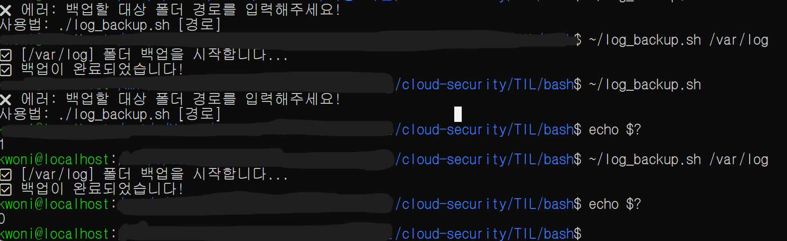
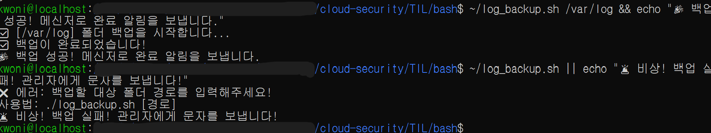
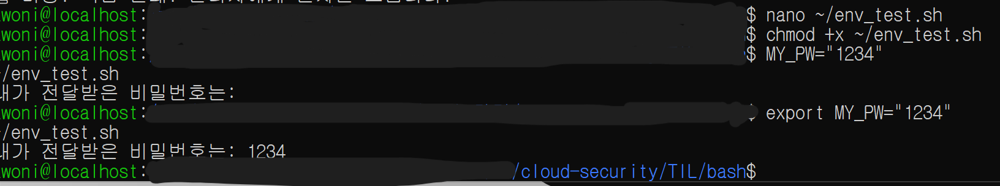
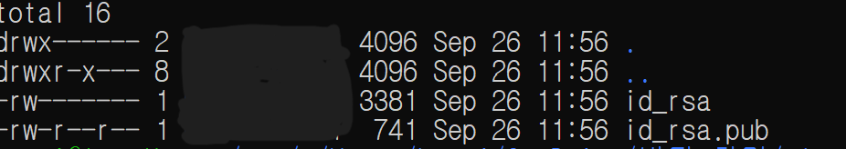
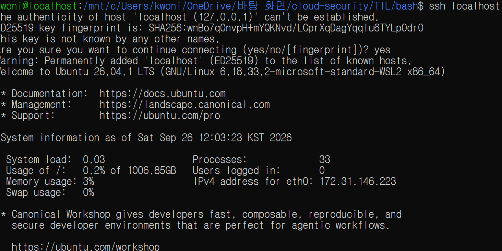
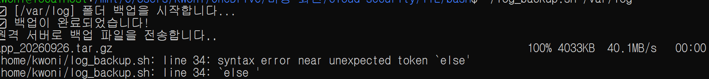

# Bash 인자·환경변수 및 SSH/SCP

**Date:** 2026-09-26
**Category:** Linux / Bash / SSH / Automation

## 1. 학습 목표

Bash Shell Script에서 실행 시 인자를 전달하고, 명령 실행 결과를 종료 상태 코드로 확인하는 방법을 학습.

또한 `AND`, `OR` 연산자와 환경 변수를 활용하고, SSH Key와 `scp`를 이용하여 원격 접속 및 파일 전송 수행.

마지막으로 학습한 내용을 하나의 백업 작업으로 연결하여 통합 실습.

---

## 2. 학습 내용

### 2.1 위치 파라미터

Shell Script 실행 시 값을 전달하고 Script 내부에서 사용하는 방법을 학습.

```bash
./log_backup.sh /var/log
```

Script에서는 전달된 값을 `$1`로 받아 백업 대상 경로로 사용.

```bash
TARGET_DIR=$1
```

이를 통해 하나의 Script에 경로를 고정하지 않고 실행 시 값을 전달하여 재사용할 수 있음을 확인함.

또한 인자가 전달되지 않았는지 확인하는 조건도 적용했다.

```bash
if [ -z "$TARGET_DIR" ]; then
    echo "❌ 에러: 백업할 대상 폴더 경로를 입력해주세요!"
    echo "사용법: ./log_backup.sh [경로]"
    exit 1
fi
```

입력한 경로가 실제 디렉터리인지도 확인함.

```bash
if [ ! -d "$TARGET_DIR" ]; then
    echo "❌ 에러: '$TARGET_DIR' 경로를 찾을 수 없습니다."
    exit 1
fi
```



### 2.2 종료 상태 코드

Script 실행 후 `$?`를 이용하여 직전 명령의 종료 상태를 확인함.

```bash
~/log_backup.sh
echo $?
```

인자가 없어 실패한 경우:

```text
1
```

정상적으로 실행된 경우:

```text
0
```

이 출력되는 것을 확인함.

이를 통해 Shell Script에서 **정상 실행은 `0`, 실패는 `0`이 아닌 종료 상태 코드로 구분**할 수 있음을 확인함.

### 2.3 AND / OR 연산자

명령의 실행 결과에 따라 다음 명령을 실행하는 방법을 확인함.

```bash
~/log_backup.sh /var/log && echo "🎉 백업 성공!"
```

백업이 정상적으로 완료된 경우에만 다음 명령이 실행되는 것을 확인함.

반대로:

```bash
~/log_backup.sh || echo "🚨 백업 실패!"
```

와 같이 사용하여 Script가 실패했을 때 후속 명령을 실행할 수 있음을 확인함.



### 2.4 환경 변수와 `export`

일반 변수로 선언한 값은 현재 Shell에서는 사용할 수 있지만, 실행한 Script와 같은 자식 프로세스에는 환경변수로 전달되지 않는 것을 확인.

```bash
MY_PW="1234"
~/env_test.sh
```

일반 변수로 선언한 경우 Script에서 값을 전달받지 못하는 것을 확인함.

이후:

```bash
export MY_PW="1234"
~/env_test.sh
```

와 같이 `export`를 사용하자 Script에서 환경 변수 값을 전달받을 수 있음을 확인함.

실습에는 테스트용 값을 사용했으며, 실제 비밀번호나 인증정보를 공개 저장소에 저장해서는 안 된다는 점도 함께 확인함.



### 2.5 SSH Key 생성과 파일 권한

SSH Key 기반 인증을 위해 RSA 4096비트 Key를 생성함.

```bash
ssh-keygen -t rsa -b 4096
```

생성된 Key 파일을 확인함.

```bash
ls -al ~/.ssh/
```

실습 환경에서 확인된 권한은 다음과 같았음.

```text
-rw------- ... id_rsa
-rw-r--r-- ... id_rsa.pub
```

| 파일           | 역할                | 실습에서 확인한 권한 |
| ------------ | ----------------- | ----------- |
| `id_rsa`     | 개인키 (Private Key) | `600`       |
| `id_rsa.pub` | 공개키 (Public Key)  | `644`       |

개인키는 클라이언트에서 보관하는 비밀 정보이므로 외부에 공개하면 안 되며, 공개키는 인증을 위해 서버에 등록할 수 있음.

공개키를 `authorized_keys`에 등록하고 파일 권한을 `600`으로 설정.

```bash
cat ~/.ssh/id_rsa.pub >> ~/.ssh/authorized_keys
chmod 600 ~/.ssh/authorized_keys
```

이 과정에서 **개인키의 권한과 `authorized_keys`의 권한은 서로 다른 의미**임을 구분했음.

* `id_rsa` → 클라이언트가 보관하는 개인키
* `id_rsa.pub` → 서버에 등록할 수 있는 공개키
* `authorized_keys` → SSH 서버 측에서 해당 계정에 허용할 공개키를 등록하는 파일



### 2.6 SSH 원격 접속 및 인증 흐름

SSH(Secure Shell)를 이용하여 원격 시스템에 접속하고 명령을 실행하는 기본적인 방법을 학습했음.

이번 실습에서는 동일한 WSL 환경의 `localhost`를 원격 접속 대상으로 사용했음.

```bash
ssh localhost
```

SSH 접속이 정상적으로 이루어진 후 원격 세션에서 작업할 수 있음을 확인했으며, 작업을 마친 뒤 다음 명령으로 세션을 종료했음.

```bash
exit
```

SSH Key 기반 인증의 기본 흐름은 다음과 같이 이해함.

```text
[클라이언트]
개인키(private key) 보유
        │
        │ SSH 접속 요청
        ▼
[SSH 서버]
사용자 계정의 authorized_keys에
공개키(public key) 등록
        │
        │ 클라이언트가 개인키를 보유하고 있음을 증명
        │ 서버는 등록된 공개키로 검증
        ▼
공개키 기반 사용자 인증 성공
        │
        ▼
원격 SSH 세션 생성
```

개인키는 클라이언트에 보관하고, 공개키는 접속 대상 서버의 해당 사용자 `authorized_keys`에 등록.

또한 최초 SSH 접속 시 표시되는 Host Key 확인은 **사용자 인증에 사용하는 공개키/개인키와 별개의 서버 신뢰 확인 과정**이라는 점 구분.

이번 실습에서는 이후 `scp`를 이용해 원격 시스템으로 파일을 전송함으로써 **SSH 원격 접속과 파일 전송이 연결되는 기본적인 흐름**까지 경험함.



### 2.7 SSH 서버 설정

처음 SSH 서비스를 시작하려 했으나 SSH 서버가 설치되어 있지 않아 서비스를 시작할 수 없었음.

```bash
sudo service ssh start
```

이후 `openssh-server` 설치.

```bash
sudo apt update && sudo apt install openssh-server -y
```

설치 후 SSH 서비스를 시작하고 상태를 확인.

```bash
sudo service ssh start
sudo service ssh status
```

### 2.8 SCP를 이용한 파일 전송

`scp`를 이용하여 백업 파일을 SSH를 통해 전달.

```bash
scp ~/backup/app_20260926.tar.gz kwoni@localhost:/home/kwoni/backup/
```

파일이 정상적으로 전송되는 것을 확인.



### 2.9 통합 백업 Script

앞서 학습한 Bash 인자, 조건 처리, 종료 상태 코드, SSH/SCP를 하나의 Script에 연결.

전체 작업 흐름은 다음과 같음.

```text
백업 대상 경로 입력
        ↓
경로 검증
        ↓
백업 디렉터리 생성
        ↓
tar를 이용한 압축
        ↓
SCP로 원격 전송
        ↓
전송 성공 여부 확인
```

최종적으로 사용한 Script는 다음과 같음.

```bash
#!/bin/bash

TARGET_DIR=$1
BACKUP_DIR="/home/kwoni/backup"
DATE=$(date +%Y%m%d)

if [ -z "$TARGET_DIR" ]; then
    echo "❌ 에러: 경로를 입력해주세요!"
    exit 1
fi

if [ ! -d "$TARGET_DIR" ]; then
    echo "❌ 에러: 폴더를 찾을 수 없습니다."
    exit 1
fi

echo "✅ 백업 시작..."
mkdir -p "$BACKUP_DIR"

tar -czf "$BACKUP_DIR/app_$DATE.tar.gz" \
    -C "$TARGET_DIR" . 2>/dev/null

scp "$BACKUP_DIR/app_$DATE.tar.gz" \
    kwoni@localhost:/home/kwoni/backup/

if [ $? -eq 0 ]; then
    echo "🎉 원격 전송 완료!"
else
    echo "🚨 전송 실패"
    exit 1
fi
```

`/var/log`를 대상으로 백업 파일을 생성하고 `scp`로 localhost의 `/home/kwoni/backup/` 경로로 전송한 뒤 성공 여부를 확인.

---

## 3. Hands-on

| 학습 항목         | 실제 수행 내용                             | 확인 결과                         |                 |                    |
| ------------- | ------------------------------------ | ----------------------------- | --------------- | ------------------ |
| **인자 전달**     | `./log_backup.sh /var/log` 형태로 경로 전달 | `$1`을 통해 Script에서 전달받은 경로 사용  |                 |                    |
| **예외 처리**     | 인자 누락 및 디렉터리 존재 여부 확인                | 잘못된 입력에서 `exit 1` 발생          |                 |                    |
| **종료 상태 코드**  | `echo $?` 실행                         | 실패 `1`, 성공 `0` 확인             |                 |                    |
| **AND / OR**  | `&&`, `                              |                               | `를 이용해 후속 명령 실행 | 성공/실패에 따른 작업 연결 확인 |
| **환경 변수**     | `export MY_PW=...` 후 Script 실행       | 환경 변수가 Script에 전달되는 것을 확인     |                 |                    |
| **SSH Key**   | RSA 4096 Key 생성 및 공개 Key 등록          | 공개키/개인키의 역할 및 Key 기반 인증 구조 확인 |                 |                    |
| **SSH**       | SSH 서버 설치 및 `localhost` 접속           | SSH 접속 및 세션 생성 확인             |                 |                    |
| **SCP**       | 백업 파일을 localhost의 지정 경로로 전송          | 파일 전송 성공 확인                   |                 |                    |
| **통합 Script** | 백업 → 압축 → SCP → 성공 여부 확인             | 전체 작업 흐름 정상 수행                |                 |                    |

---

## 4. Troubleshooting

### 4.1 SSH 서비스가 존재하지 않는 문제

처음 SSH 서비스를 시작하려 했으나 다음과 같은 오류 발생.

```text
Failed to start ssh.service: Unit ssh.service not found.
```

확인 결과 SSH 서버가 설치되어 있지 않아 `openssh-server`를 설치한 뒤 다시 서비스를 시작.

```bash
sudo apt update && sudo apt install openssh-server -y
```

이후:

```bash
sudo service ssh start
sudo service ssh status
```

로 정상 실행 상태를 확인.

### 4.2 SSH 관련 명령어 오입력

SSH 서비스를 시작하는 과정에서 명령어를 잘못 입력하여 오류 발생.

```text
ssh service ssh start
```

잘못된 명령어가 실행되어 hostname 관련 오류가 발생했고, 이후 올바른:

```bash
sudo service ssh start
```

명령으로 수정.

또한 `serivice`와 같이 명령어를 잘못 입력하여 `command not found`가 발생한 경우도 확인함.

### 4.3 기존 Script의 문법 오류

통합 Script를 수정하는 과정에서 `else` 구문 위치에 문제가 발생하여 다음 오류가 발생했음.

```text
syntax error near unexpected token `else'
```

Script를 다시 수정한 뒤 재실행하며 오류 발생한 위치 확인.

### 4.4 경로 및 Script 버전 혼선

서로 다른 위치에 있는 `log_backup.sh`를 실행하면서 Script 내용과 실행 결과가 달라지는 문제가 발생했다.

이를 확인하기 위해 홈 디렉터리의 Script를 다시 수정하고 내용을 확인했음.

```bash
nano ~/log_backup.sh
cat ~/log_backup.sh
```

이를 통해 **실행하려는 Script의 실제 경로와 파일 내용을 확인하는 것이 중요하다**는 점을 경험.

---

## 5. Assessment

다음 요소를 하나의 작업 흐름으로 연결할 수 있는지 확인함.

```text
Script 실행
  ↓
인자 전달
  ↓
입력값 검증
  ↓
명령 실행
  ↓
종료 상태 확인
  ↓
AND / OR 조건 처리
  ↓
환경 변수 활용
  ↓
SSH Key 기반 인증
  ↓
SCP 파일 전송
```

마지막에는 `/var/log`를 대상으로 백업 파일을 생성하고 SCP로 전달한 뒤 성공 여부를 확인하는 통합 Script를 정상 실행함.

---

## 6. 오늘 배운 점

오늘은 Bash Script에서 외부 인자를 전달하고, 종료 상태 코드와 `AND` / `OR` 연산자를 이용하여 작업의 성공 여부에 따라 다음 작업을 연결하는 방법 학습.

또한 `export`를 이용한 환경 변수 전달과 **공개키/개인키를 이용한 SSH 인증 구조**, `scp`를 이용한 원격 파일 전송 직접 경험함.

특히 각각의 개념을 따로 사용하는 데서 끝나지 않고 **백업 Script → 압축 → SSH/SCP를 통한 전송 → 전송 결과 확인**까지 연결하면서 Bash와 Linux의 기본 명령어가 원격 작업 자동화에 활용될 수 있음을 확인함.

---

## 7. Key Takeaway

오늘은 다음 요소를 하나의 흐름으로 연결했음.

```text
Bash 인자
  ↓
입력값 검증
  ↓
종료 상태 코드
  ↓
AND / OR 조건 처리
  ↓
환경 변수
  ↓
SSH Key 기반 인증
  ↓
SCP 파일 전송
  ↓
백업 자동화
```

아직 고급 Shell Scripting을 학습한 단계는 아니지만, **Linux 명령어와 Bash Script를 이용해 로컬 작업과 원격 파일 전송을 하나의 작업 흐름으로 구성할 수 있다는 점**을 직접 경험함.

특히 SSH에서는 **개인키는 클라이언트에 보관하고 공개키를 서버에 등록하여 인증하는 기본 구조**와, SSH 서버의 Host Key 확인은 사용자 인증과 별개의 과정이라는 점을 구분함.

---

## 8. Next

Linux와 Bash에서 학습한 기본 내용을 바탕으로 Docker의 이미지와 컨테이너 구조를 학습하고, 컨테이너 실행·포트·환경 변수·볼륨 및 네트워크를 직접 실습.
